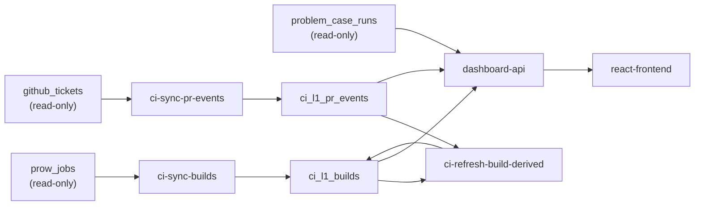

# CI Dashboard V1 Design

Status: Draft v0.2

Last updated: 2026-04-13

Reference inputs:
- `/Users/dillon/workspace/dashboard/dashboard_design.pdf`
- `/Users/dillon/workspace/ci_metrics_sample`
- `/Users/dillon/workspace/dashboard/aidlc-docs/inception/requirements/requirements.md`

## 1. Background

We want to turn the current pilot CI metrics workflow into a maintainable internal product.

The pilot already proved that useful CI metrics can be computed from existing data, but it still has clear gaps:

- pilot tables use temporary naming such as `tmp_*`
- data refresh is not yet formalized as a production update workflow
- dashboard output is still report-oriented instead of application-oriented
- current logic mixes experimental implementation details with production-facing behavior

V1 is not intended to solve every CI observability problem. V1 is intended to make the already-available CI data stable, queryable, deployable, and explorable through a dashboard application.

## 2. Goals and Non-Goals

### 2.1 Goals

- formalize CI data processing on top of the existing TiDB database and existing upstream source tables
- create production-owned downstream tables for normalized build and PR event data
- run the data update workflow automatically on prow Kubernetes with hourly freshness
- ship a dashboard application that can filter by repo, branch, job, cloud phase, and time range
- support the initial chart set that is already defined by the design PDF and can be backed by current data sources

### 2.2 Non-Goals

- no new collector for Kubernetes pod event history in V1
- no new collector for Jenkins logs or Jenkins failure parsing in V1
- no physical aggregate tables as a required part of V1
- no full import of every GitHub timeline event type
- no rewrite or rename of upstream source tables owned by other applications

## 3. Functional Requirements

### FR-01: Formalize V1 Data Layer

V1 must create project-owned formal tables in the current TiDB database while keeping the upstream source tables read-only.

Upstream source tables:

- `prow_jobs`
- `github_tickets`
- `problem_case_runs`

Required V1 project-owned tables:

- `ci_l1_builds`
- `ci_l1_pr_events`

Not required in V1:

- `ci_raw_*` tables
- physical `ci_agg_*` tables
- `ci_l1_test_case_runs`

### FR-02: Automated Data Processing

V1 must provide automated Python-based update jobs that run on prow Kubernetes and refresh dashboard data on an hourly cadence.

Required V1 jobs:

1. `ci-sync-builds`
2. `ci-sync-pr-events`
3. `ci-refresh-build-derived`

The jobs must support:

- incremental execution
- idempotent re-run behavior
- batch processing against TiDB Cloud
- structured logging

### FR-03: Read-Only Query API

V1 must provide a read-only API service that:

- serves filter options
- executes chart queries
- aggregates from project-owned L1 tables and upstream `problem_case_runs`
- hides SQL complexity from the dashboard web

### FR-04: Dashboard Web

V1 must provide a dashboard web application that:

- supports filter-based exploration across all repos and all branches
- renders the initial agreed chart set
- uses the query API rather than accessing the database directly

Required V1 dashboard sections:

1. Overview
2. Flaky Test
3. Failure Classification

### FR-05: Deploy on Prow Kubernetes

V1 must deploy the following on prow Kubernetes:

- Python CronJobs for data updates
- dashboard app containing:
  - FastAPI backend API
  - React frontend

The deployment approach should follow existing `ee-apps` chart patterns rather than inventing a separate deployment mechanism.

## 4. Non-Functional Requirements

### NFR-01: Performance

- common dashboard API queries should target sub-2-second response time for normal filtered scopes
- broad-scope queries may be slower, but should remain acceptable for internal interactive use
- hourly data update jobs should complete comfortably within the hourly window

### NFR-02: Reliability

- update jobs must be idempotent
- update jobs must be safe to rerun after partial failure
- incremental processing must avoid full-table rescans unless an explicit backfill is requested

### NFR-03: Maintainability

- the design must remain compatible with the current `ee-apps` monorepo layout
- Python update logic should reuse proven ideas from `ci_metrics_sample`
- API and web responsibilities should stay logically separated even when packaged as one dashboard app in V1

### NFR-04: Security

- upstream data sources remain read-only from this project
- credentials and secrets must not be embedded in source code, Docker images, committed config files, or chart default values
- database credentials must be provided via Kubernetes secrets or equivalent runtime configuration
- TiDB connections must continue to use TLS

### NFR-05: Observability

- data update jobs must log progress, batch timings, and failure context
- API and web services should expose health endpoints
- data freshness must be easy to inspect through a query or status endpoint

## 5. Confirmed Design Decisions

The following decisions are already confirmed for V1:

- data collection scope is all repos and all branches
- dashboard scope is filter-based; data collection is not pre-scoped to a single repo or branch
- V1 uses only the existing upstream tables `prow_jobs`, `github_tickets`, and `problem_case_runs`
- these three upstream tables are owned by other applications and remain read-only from this project
- all new project tables stay in the current TiDB database and in the same schema as today
- hourly refresh is acceptable for V1
- the system keeps three logical roles:
  - data update jobs
  - query API
  - dashboard web
- V1 deploys query API and dashboard web together as one dashboard app
- technology choices:
  - data update jobs: Python
  - dashboard backend API: FastAPI
  - dashboard frontend: React
- V1 does not create physical `ci_agg_*` tables by default
- V1 does not create `ci_raw_*` tables by default
- `problem_case_runs` is queried directly in V1; there is no required `ci_l1_test_case_runs` table in V1

## 6. Scope

### 6.1 In Scope

- normalize `prow_jobs` into a production-owned build fact table
- normalize selected `github_tickets` PR timeline data into a production-owned PR event table
- compute build-derived fields needed by the dashboard
- expose read-only query endpoints for dashboard filters and chart data
- implement the initial dashboard pages and charts
- deploy update jobs and the dashboard app to prow Kubernetes

### 6.2 Out of Scope

- pod scheduling root-cause charts
- Jenkins log-based failure subcategory parsing
- any design that requires history from already-expired pod objects
- any dependency on a new database product

## 7. High-Level Architecture

V1 architecture:

1. Upstream source tables
   - `prow_jobs`
   - `github_tickets`
   - `problem_case_runs`

2. Python data update jobs
   - incremental sync into `ci_l1_builds`
   - incremental sync into `ci_l1_pr_events`
   - derived-field refresh for build flags and build metadata

3. Dashboard app backend
   - reads `ci_l1_builds`
   - reads `ci_l1_pr_events`
   - reads `problem_case_runs`
   - performs aggregation on demand

4. Dashboard app frontend
   - calls the dashboard backend API
   - renders filters, trend charts, comparison charts, and ranking views

5. Future collectors
   - pod data collector
   - Jenkins log collector

Future collectors are explicitly decoupled from the V1 pipeline and must not block V1 delivery.

### 7.1 Component View

The V1 system has four practical components even though API and web are deployed together:

| Component | Purpose | Primary Interfaces | Deployment Form |
| --- | --- | --- | --- |
| Data sync jobs | Incrementally normalize upstream CI data into project-owned L1 tables | CronJob CLI commands, TiDB SQL | 3 K8s CronJobs |
| Dashboard API | Serve filter options, chart queries, and freshness status | HTTP REST under `/api/v1/...`, probe endpoints | FastAPI inside dashboard app |
| Dashboard web | Render filter-first dashboard pages and charts | Browser SPA calling dashboard API | React static assets packaged into dashboard app |
| Deployment configs | Package and deploy app and jobs onto prow K8s | Helm charts, Dockerfiles, secrets/config | `charts/ci-dashboard`, `charts/ci-dashboard-jobs` |

### 7.2 Runtime Dependencies and Communication

| Component | Depends On | Communication | Notes |
| --- | --- | --- | --- |
| Data sync jobs | TiDB Cloud upstream tables and project-owned L1 tables | MySQL protocol over TLS | Reads upstream, writes downstream |
| Dashboard API | `ci_l1_builds`, `ci_l1_pr_events`, `problem_case_runs`, `ci_job_state` | MySQL protocol over TLS | Read-only query path |
| Dashboard web | Dashboard API | HTTP REST | No direct database access |
| Jobs and dashboard API | Shared TiDB tables only | No direct service-to-service call | Coordination happens through L1 tables and job state |

V1 intentionally has:

- no message queue
- no workflow orchestrator between jobs
- no direct RPC between jobs and dashboard API
- no direct frontend access to TiDB

## 8. Data Architecture



Notes:

- `problem_case_runs` is queried directly in V1
- no physical aggregate layer is required in V1
- `dashboard-api` and `react-frontend` are deployed together as one dashboard app in V1
- future pod and Jenkins collectors are intentionally excluded from this V1 graph

## 9. Source Tables and Ownership

### 9.1 `prow_jobs`

Owner: upstream application

Access mode for this project: read-only

Key observed columns:

- `id`
- `prowJobId`
- `namespace`
- `jobName`
- `type`
- `state`
- `startTime`
- `completionTime`
- `org`
- `repo`
- `base_ref`
- `pull`
- `context`
- `url`
- `retest`
- `author`
- `event_guid`
- `spec`
- `status`

Important note:

- `status` already contains `pendingTime`, `startTime`, `completionTime`, `build_id`, and `pod_name`
- this is enough to support V1 queue/run/total duration derivation without pod event history

### 9.2 `github_tickets`

Owner: upstream application

Access mode for this project: read-only

Key observed columns:

- `type`
- `repo`
- `number`
- `title`
- `body`
- `state`
- `created_at`
- `updated_at`
- `merged`
- `merged_at`
- `commit_count`
- `labels`
- `comments`
- `review`
- `review_comments`
- `timeline`
- `branches`

Important note:

- `branches` contains structured base/head branch metadata and is valuable for PR target branch alignment
- `timeline` contains many more event types than V1 needs

### 9.3 `problem_case_runs`

Owner: upstream application

Access mode for this project: read-only

Observed schema:

- `id`
- `repo`
- `branch`
- `suite_name`
- `case_name`
- `flaky`
- `timecost_ms`
- `report_time`
- `build_url`
- `reason`

Important note:

- this is already a usable source fact table for flaky case analysis
- V1 will query it directly instead of creating a duplicated downstream copy

## 10. Findings from Recent `github_tickets` Audit

On 2026-04-13 we sampled recent pull-request activity for the window `2026-04-07` to `2026-04-09`.

Observed counts:

- recent updated pull rows in `github_tickets`: `338`
- rows with PR keys that can be matched to current `tmp_builds` history: `175`
- rows not matched to current `tmp_builds` history: `163`

Interpretation:

- limiting import to build-linked PRs does omit a meaningful amount of PR metadata
- however, most omitted data is not required for the V1 CI dashboard path
- V1 should stay build-centric rather than importing the full GitHub PR workflow surface area

Recent timeline events for build-linked PRs included many non-V1 event types:

- `labeled`
- `reviewed`
- `review_requested`
- `closed`
- `merged`
- `cross-referenced`
- `head_ref_deleted`

These are useful for future PR workflow analytics, but they are not required for the V1 CI dashboard.

### 10.1 Retest Parsing Finding

The pilot logic currently treats any comment body containing the substring `/retest` as a retest event.

In the same `2026-04-07` to `2026-04-09` sample:

- exact retest command comments on build-linked PRs: `245`
- bot instruction comments that only mention `/retest`: `63`
- other comments containing `/retest`: `3`

This means roughly `20.3%` of retest-like comments in the sample were bot instruction comments rather than actual user retest commands.

V1 must fix this logic.

V1 retest rule:

- treat a comment as a retest event only when the normalized command is an exact supported command
- initial supported commands:
  - `/retest`
  - `/retest-required`
- bot instruction comments that merely mention those commands must not be counted as retest events

### 10.2 Accepted Source Coverage Limits

On 2026-04-14 we also validated recent real-database behavior against the current V1 implementation.

Observed outcome:

- `github_tickets` coverage is repo-dependent rather than uniformly fresh
- some business repos such as `pingcap/tidb` and `pingcap/ticdc` can lag the newest PR numbers by a short time window
- some non-target repos such as `pingcap/docs`, `pingcap/docs-cn`, and `PingCAP-QE/ci` are not reliable PR-event sources for V1

Accepted V1 interpretation:

- raw build ingestion remains all-repo and all-branch
- `github_tickets` is treated as a best-effort PR enrichment source rather than a completeness-guaranteed fact source
- missing `github_tickets` rows must not block build import
- `target_branch`, `head_ref`, and `head_sha` may remain null when no matching PR ticket row is available
- PR-event completeness for `pingcap/docs`, `pingcap/docs-cn`, and `PingCAP-QE/ci` is explicitly out of scope in V1
- short `github_tickets` lag for `pingcap/tidb` and `pingcap/ticdc` is accepted for V1 because PR-event real-time freshness is not a hard requirement

## 11. Data Model

### 11.1 Raw Layer Strategy in V1

V1 does not create `ci_raw_*` tables by default.

Reasoning:

- `prow_jobs`, `github_tickets`, and `problem_case_runs` already function as the raw source layer
- these source tables are owned by other applications and stay read-only
- duplicating them into project-owned raw tables would add storage and refresh cost without immediate V1 value

### 11.2 `ci_l1_builds`

Purpose:

- project-owned normalized build fact table for dashboard and query API usage

Grain:

- one row per Prow job/build

Primary source:

- `prow_jobs`

Core design properties:

- includes all builds, not only PR builds
- uses fields to distinguish PR builds from non-PR builds
- stores derived timing and flaky-analysis fields required by V1 charts

Recommended columns:

| Column | Meaning |
| --- | --- |
| `id` | downstream table PK |
| `source_prow_row_id` | source `prow_jobs.id` |
| `source_prow_job_id` | source `prow_jobs.prowJobId`, unique logical build identifier |
| `namespace` | copied from source |
| `job_name` | copied from source |
| `job_type` | copied from source `type` |
| `state` | copied from source |
| `optional` | copied from source |
| `report` | copied from source |
| `org` | source repo owner |
| `repo` | source repo name |
| `repo_full_name` | normalized `org/repo` |
| `base_ref` | source base ref when available |
| `pr_number` | source `pull` when available |
| `is_pr_build` | derived boolean |
| `context` | source context |
| `url` | build URL |
| `author` | source author |
| `retest` | source retest flag when available |
| `event_guid` | source event guid |
| `build_id` | extracted from source status JSON |
| `pod_name` | extracted from source status JSON |
| `pending_time` | extracted from source status JSON |
| `start_time` | normalized build start time |
| `completion_time` | normalized build completion time |
| `queue_wait_seconds` | `pending_time - start_time` when available |
| `run_seconds` | `completion_time - pending_time` when available |
| `total_seconds` | `completion_time - start_time` when available |
| `head_sha` | extracted from source spec JSON |
| `target_branch` | PR target branch after PR-event enrichment |
| `cloud_phase` | derived cloud phase classification |
| `is_flaky` | derived flaky flag |
| `is_retry_loop` | derived retry-loop flag |
| `has_flaky_case_match` | whether a flaky case record can be matched from `problem_case_runs` |
| `failure_category` | nullable V1 failure category |
| `failure_subcategory` | nullable in V1 |
| `created_at` | downstream insert time |
| `updated_at` | downstream last refresh time |

Recommended constraints and indexes:

- unique key on `source_prow_job_id`
- index on `(repo_full_name, start_time)`
- index on `(repo_full_name, target_branch, start_time)`
- index on `(repo_full_name, pr_number, job_name, head_sha, start_time)`

Notes:

- `target_branch` is null for builds that cannot be aligned to a PR target branch
- `cloud_phase` is a derived business field using the V1 rule below:
  - `GCP` when `url` starts with `https://prow.tidb.net/`
  - `IDC` for all other URLs
- `has_flaky_case_match` is a stricter evidence field derived from `problem_case_runs` by:
  - normalized `build_url` match
  - `problem_case_runs.flaky = 1`
  - `report_time` between build `start_time` and `start_time + 24h`
- `failure_category` in V1 is intentionally conservative:
  - set `FLAKY_TEST` when build-level pilot logic marks the row as flaky or retry-loop
  - keep unsupported cases null at storage level
- V1 should not infer `INFRA` or `CODE_DEFECT` without pod-event or Jenkins-log evidence
- V1 display logic may map null `failure_category` to `UNCLASSIFIED` for charts

### 11.3 `ci_l1_pr_events`

Purpose:

- project-owned normalized PR event and PR snapshot table for build alignment and retest analysis

Grain:

- one row per imported PR event or synthetic PR snapshot row

Primary source:

- `github_tickets`

Import scope in V1:

- only PRs that are build-linked through `ci_l1_builds`
- only selected event types required by V1
- persist one synthetic `pr_snapshot` row per tracked PR so `target_branch` and head metadata remain queryable even when no selected timeline event exists

Imported event types in V1:

- one synthetic `pr_snapshot` row per tracked PR
- committed events
- exact retest command comments

Fields to store:

| Column | Meaning |
| --- | --- |
| `id` | downstream table PK |
| `repo` | normalized repo string |
| `pr_number` | PR number |
| `event_key` | unique idempotent event key |
| `event_time` | normalized event timestamp |
| `event_type` | `pr_snapshot`, `committed`, or `retest_comment` |
| `actor_login` | event actor |
| `comment_id` | comment id for comment events |
| `comment_body` | raw comment body for exact retest parsing and auditability |
| `retest_event` | boolean |
| `commit_sha` | commit SHA for commit events |
| `target_branch` | base branch from `branches.base.ref` |
| `head_ref` | optional head branch name from `branches.head.ref` |
| `head_sha` | optional head SHA snapshot from `branches.head.sha` |
| `created_at` | downstream insert time |
| `updated_at` | downstream last refresh time |

Recommended constraints and indexes:

- unique key on `(repo, pr_number, event_key)`
- index on `(repo, pr_number, event_time)`
- index on `(repo, target_branch, event_time)`
- index on `(commit_sha)`

Fields intentionally not imported in V1:

- generic comments
- labels
- reviews
- review requests
- merge timeline events
- close/reopen timeline events
- non-build-linked PR metadata

### 11.4 `problem_case_runs` Usage in V1

V1 reads `problem_case_runs` directly from the upstream table.

Reasoning:

- it is already a usable source fact table
- current complexity is mainly in the build and PR event layers
- case-to-build mapping can be handled in query logic for V1

Deferred optimization:

- a future `ci_l1_test_case_runs` table may be added if case-to-build mapping becomes heavily reused or query performance becomes a problem

### 11.5 No Physical Aggregate Tables in V1

V1 query strategy:

- query and aggregate from `ci_l1_builds`, `ci_l1_pr_events`, and `problem_case_runs` at request time

We intentionally defer physical `ci_agg_*` tables until one of the following becomes true:

- query latency is unacceptable
- the same aggregation logic is repeated in too many places
- hourly snapshot persistence is needed for metric stability
- future data collectors increase query complexity materially

## 12. Data Update Jobs

V1 uses Python update jobs and runs them on prow Kubernetes as CronJobs.

### 12.1 Job Set

Recommended V1 job set:

1. `ci-sync-builds`
   - source: `prow_jobs`
   - target: `ci_l1_builds`
   - responsibility:
     - incremental build ingest
     - JSON extraction for `head_sha`, `pending_time`, `build_id`, `pod_name`
     - base normalized timing fields

2. `ci-sync-pr-events`
   - source: `github_tickets`
   - target: `ci_l1_pr_events`
   - responsibility:
     - determine build-linked PR set from `ci_l1_builds`
     - fetch matching PR records from `github_tickets`
     - parse commit events and exact retest command comments
     - materialize one synthetic `pr_snapshot` row per tracked PR
     - import branch metadata needed for `target_branch`

3. `ci-refresh-build-derived`
   - source: `ci_l1_builds` plus `ci_l1_pr_events`
   - target: `ci_l1_builds`
   - responsibility:
      - backfill `target_branch`
      - recompute `is_flaky`
      - recompute `is_retry_loop`
      - recompute `has_flaky_case_match`
      - recompute `cloud_phase` using build URL prefix classification
      - recompute V1 failure classification fields using pilot-supported logic only

### 12.2 Scheduling

V1 target freshness:

- hourly

Recommended staggered schedule:

- `ci-sync-builds`: around `HH:05`
- `ci-sync-pr-events`: around `HH:15`
- `ci-refresh-build-derived`: around `HH:25`

This keeps the dependency order explicit while avoiding a single all-in-one update job.

### 12.3 Incremental Strategy

`ci-sync-builds`:

- incremental by source watermark using `prow_jobs.id` and/or `startTime`
- upsert by `source_prow_job_id`

`ci-sync-pr-events`:

- build the candidate PR set from `ci_l1_builds`
- only query `github_tickets` for build-linked PRs
- incremental by:
  - build-linked PRs touched since the last run
  - and/or `github_tickets.updated_at` watermark for already-known build-linked PRs
- upsert by `event_key`

`ci-refresh-build-derived`:

- recompute only impacted `(repo, pr_number, job_name, head_sha)` groups when possible
- avoid full-table rescans unless an explicit backfill is requested

### 12.4 Idempotency and Safety

Requirements:

- every job must be safe to rerun
- update jobs must not mutate upstream source tables
- downstream tables must have unique keys that prevent duplicate logical rows
- jobs must log progress and batch timing

## 13. Query API

The query API is a read-only FastAPI service inside the dashboard app.

Responsibilities:

- serve filter option data
- execute dashboard chart queries
- aggregate from L1/source tables on demand
- hide SQL complexity from the front end

Detailed route contracts and response shapes are defined in the companion implementation spec:

- `/Users/dillon/workspace/ee-apps-worktrees/ci-dashboard-v1/ci-dashboard/docs/ci-dashboard-v1-implementation.md`

V1 query sources:

- `ci_l1_builds`
- `ci_l1_pr_events`
- `problem_case_runs`

Recommended filter dimensions:

- repo
- branch
- job name
- cloud phase
- time range
- build type
- PR-only toggle where required

Recommended V1 endpoint groups:

- `/api/v1/status/...`
- `/api/v1/filters/...`
- `/api/v1/flaky/...`
- `/api/v1/builds/...`
- `/api/v1/failures/...`

Recommended V1 chart-oriented endpoints:

- flaky main trend
- flaky composition trend
- flaky top job contribution
- flaky period comparison
- build success/failure trend
- build duration trend
- cloud comparison
- failure category trend
- failure category current share

Deferred endpoint groups:

- pod scheduling reason analysis
- Jenkins-derived failure subcategory analysis

The API should not expose direct table names or raw SQL concepts to the dashboard.

V1 note on failure-category endpoints:

- storage may contain null `failure_category` for most non-pilot-classifiable rows
- storage may expose `has_flaky_case_match` as a stricter evidence signal alongside `failure_category`
- chart responses should expose a presentation bucket such as `UNCLASSIFIED` for null values
- V1 should not claim `INFRA` or `CODE_DEFECT` breakdown accuracy before pod/Jenkins collectors exist

## 14. Dashboard Web

The dashboard web is a React frontend packaged and deployed with the FastAPI backend as one dashboard app.

V1 dashboard principles:

- internal dashboard, not a static report dump
- filter-first UX
- charts are backed by live API queries
- repo and branch are filters, not deployment-specific hard-coding

Recommended V1 page structure:

1. Overview
   - success/failure trend
   - queue/run/total duration trend
   - cloud phase comparison

2. Flaky Test
   - flaky main trend
   - flaky composition trend
   - top job contribution
   - period comparison

3. Failure Classification
   - failure category trend
   - current category share

### 14.1 V1 Chart Coverage

Charts included in V1:

- flaky main trend
- flaky composition trend
- flaky top job contribution
- flaky period comparison
- build success/failure trend
- build queue/run/total trend
- cloud phase comparison using available build timing fields
- failure category trend
- failure category share

Failure-category chart interpretation in V1:

- these charts are provisional and conservative
- they should be interpreted as `pilot-classified` vs `unclassified`, not as final root-cause truth
- case-level flaky evidence should be treated as an additional confidence signal, not as the sole gating condition for `FLAKY_TEST`

Charts deferred until pod or Jenkins collectors exist:

- pod scheduling reason Pareto
- pod scheduling distribution by event reason
- Jenkins-derived failure subcategory ranking

### 14.2 Implemented Chart: Job Migration Runtime Comparison

Purpose:

- compare the same Jenkins job before and after migration to GCP
- surface the jobs that improved most and regressed most after migration
- keep the metric focused on successful build runtime only

#### 14.2.1 Same-Job Identity

For this chart, `same job` should not be matched by host name.

The comparison key should be a normalized Jenkins job path:

- strip host prefix:
  - `https://prow.tidb.net`
  - `https://do.pingcap.net`
- strip trailing `/display/redirect`
- strip trailing numeric build-number segment when present
- trim trailing `/`

Examples:

- `https://prow.tidb.net/jenkins/job/pingcap/job/tidb/job/ghpr_check/`
- `https://do.pingcap.net/jenkins/job/pingcap/job/tidb/job/ghpr_check/`

Both map to the same logical job key:

- `/jenkins/job/pingcap/job/tidb/job/ghpr_check`

Implementation note:

- existing `job_name` remains the preferred human-readable label
- V1 currently derives `normalized_job_path` at query time from `normalized_build_key`, stripping the trailing `/<build_id>` segment when present
- this keeps same-job matching host-independent without changing the existing read-only upstream tables
- if this comparison becomes hot or reused by more charts later, we can promote `normalized_job_path` into an explicit derived field in our own writable layer

#### 14.2.2 Window Definitions

This chart is explicitly `success-only`.

Failed builds are excluded because failed jobs can stop at arbitrary points and do not provide a stable runtime baseline.

Per logical job:

- `IDC baseline avg run time`
  - average `run_seconds` of successful IDC builds
  - window = the 14 calendar days immediately before the job's first successful GCP build
  - if IDC and GCP overlap for a period, the baseline still uses only the pre-GCP IDC window
- `GCP current avg run time`
  - average `run_seconds` of successful GCP builds
  - window = the latest 14 calendar days ending at the selected dashboard `end_date`
  - if `end_date` is absent, use the latest available successful GCP build day in scope

Supporting sample metrics:

- `idc_success_count`
- `gcp_success_count`
- `first_gcp_success_at`

Implemented eligibility rule:

- hide jobs with too few successful samples on either side
- default proposal: require at least `5` successful IDC builds and `5` successful GCP builds

V1 uses this threshold directly.

#### 14.2.3 Derived Metrics

Per logical job:

- `idc_baseline_avg_run_s`
- `gcp_recent_avg_run_s`
- `delta_run_s = gcp_recent_avg_run_s - idc_baseline_avg_run_s`
- `delta_pct = (gcp_recent_avg_run_s - idc_baseline_avg_run_s) / idc_baseline_avg_run_s * 100`

Interpretation:

- `delta_run_s < 0`: improvement
- `delta_run_s > 0`: regression

Ranking rule:

- improvements are sorted by most negative `delta_run_s`
- regressions are sorted by most positive `delta_run_s`

Ranking should use absolute time delta first, not percent delta, because tiny baseline jobs can look artificially dramatic in percentage-only ranking.

#### 14.2.4 Filter Semantics

Implemented filter behavior:

- respect:
  - repo
  - branch
  - job name
  - `end_date`
- ignore:
  - `cloud_phase`
  - dashboard `granularity`
  - dashboard `start_date`

Reasoning:

- the chart itself is a cross-cloud comparison, so `cloud_phase` must not narrow it
- the metric uses fixed 14-day windows, so `start_date` should not silently cut the baseline or recent window
- `end_date` is still useful as the anchor for the recent GCP window

Branch note:

- if branch is blank, the chart aggregates across the selected branch scope
- for the cleanest migration comparison, branch-specific review is recommended when the same job behaves differently across branches

#### 14.2.5 Recommended Visualization

Implemented chart type:

- two horizontal dumbbell ranking charts inside one panel

Why this chart:

- the user can see both times directly, not just a delta
- before/after direction is obvious from the connecting line
- the same x-axis scale makes improvements and regressions visually comparable

Implemented panel layout:

1. `Top 10 improved jobs`
   - green connector / accent
   - sorted by largest runtime reduction
2. `Top 10 regressed jobs`
   - red connector / accent
   - sorted by largest runtime increase

Per row, show:

- job label: `job_name`
- secondary key or tooltip: normalized Jenkins job path
- IDC baseline point
- GCP recent point
- inline annotation such as:
  - `IDC 18.4m -> GCP 11.2m`
  - `-7.2m (-39.1%)`
  - `IDC n=23, GCP n=19`

Why `Top 10` on both sides:

- the page is now used as a review surface, so it is useful to keep the improved and regressed sides symmetric
- showing 10 improved jobs makes it easier to spot which migrations are consistently getting faster, not just the most extreme few

#### 14.2.6 Implemented API Shape

Implemented endpoint:

- `/api/v1/builds/migration-runtime-comparison`

Implemented response shape:

```json
{
  "improved": [
    {
      "job_name": "ghpr_check",
      "normalized_job_path": "/jenkins/job/pingcap/job/tidb/job/ghpr_check",
      "idc_baseline_avg_run_s": 1104,
      "gcp_recent_avg_run_s": 672,
      "delta_run_s": -432,
      "delta_pct": -39.13,
      "idc_success_count": 23,
      "gcp_success_count": 19,
      "first_gcp_success_at": "2026-03-01T08:12:00Z"
    }
  ],
  "regressed": [
    {
      "job_name": "pull_unit_test",
      "normalized_job_path": "/jenkins/job/pingcap/job/tidb/job/pull_unit_test",
      "idc_baseline_avg_run_s": 420,
      "gcp_recent_avg_run_s": 605,
      "delta_run_s": 185,
      "delta_pct": 44.05,
      "idc_success_count": 31,
      "gcp_success_count": 28,
      "first_gcp_success_at": "2026-03-18T02:45:00Z"
    }
  ],
  "meta": {
    "anchor_end_date": "2026-04-15",
    "window_days": 14,
    "min_success_runs_each_side": 5,
    "improved_limit": 10,
    "regressed_limit": 10,
    "comparison_key": "normalized_job_path"
  }
}
```

#### 14.2.7 Next Iteration Notes

The following items remain good follow-up points after the first implementation:

- whether we should persist `normalized_job_path` in our writable derived layer for reuse and query efficiency
- whether the panel should later support alternate success-only metrics such as queue wait or total duration
- whether the ranking board should add drilldown or tooltip detail for branch- or job-level investigation

## 15. Deployment on Prow Kubernetes

V1 deployables:

- Python CronJobs for data update
- dashboard app (`FastAPI + React`) Deployment + Service + Ingress/HTTPRoute

Repository alignment:

- existing repo already contains Helm chart patterns under `charts/`
- V1 should follow the same deployment style instead of inventing a new deployment mechanism

Recommended chart layout:

- top-level app module under `ee-apps/ci-dashboard/`
- `charts/ci-dashboard` for the dashboard app
- `charts/ci-dashboard-jobs` for CronJobs
- app chart should reuse the existing `Deployment + Service + Ingress/HTTPRoute` pattern already used by other `ee-apps` charts

Required runtime configuration:

- TiDB connection settings
- TLS CA path for TiDB
- Cron schedules
- API base URL for the web
- optional internal feature flags if needed later

## 16. Phase Plan

### Phase V1: MVP Delivery

- create `ci_l1_builds`
- create `ci_l1_pr_events`
- add required indexes and unique constraints
- backfill data from `prow_jobs` and `github_tickets`
- implement exact retest parsing
- implement derived-field refresh logic
- deploy hourly CronJobs
- implement FastAPI endpoints for V1 charts
- implement dashboard app sections for Overview, Flaky Test, and Failure Classification

### Phase V1.5: Hardening and Tuning

- validate chart parity against pilot reports
- tune query performance and add indexes as needed
- improve freshness and health visibility
- decide whether repeated case-to-build mapping should stay query-time or move into a dedicated optimization layer
- decide whether specific query paths need materialization

### Phase V2: Data Expansion

- add Kubernetes pod event collection
- add Jenkins log collection and parsing
- expand failure subcategories
- add pod scheduling charts
- add more sophisticated precomputed aggregates only if justified by scale or latency

## 17. Validation Requirements

Data validation:

- build counts in `ci_l1_builds` track source `prow_jobs` incrementally
- PR event counts are stable across reruns
- `target_branch` fill rate is measured
- exact retest parsing excludes bot instruction comments
- `is_flaky` and `is_retry_loop` remain consistent with known pilot cases

Application validation:

- every V1 chart matches the expected metric definition
- filter changes do not require page reloads
- API response times are acceptable without physical aggregate tables

Operational validation:

- job failures are visible
- last successful refresh time is visible
- data freshness can be checked by a simple query or a dedicated status endpoint such as `/api/v1/status/freshness`

## 18. Decisions Log

| Decision | Choice | Rationale |
| --- | --- | --- |
| Source table ownership | `prow_jobs`, `github_tickets`, `problem_case_runs` stay read-only | They are owned by other applications |
| Data collection scope | all repos, all branches | Collection should represent the full CI domain; dashboard scope is filter-based |
| V1 downstream tables | `ci_l1_builds`, `ci_l1_pr_events` | Smallest useful formalized data model |
| `problem_case_runs` in V1 | query directly | Avoid premature duplication and extra sync complexity |
| Aggregate tables in V1 | not required | Query-time aggregation is simpler until proven insufficient |
| PR import scope | build-linked PRs only | Keeps V1 focused on CI data instead of full PR workflow analytics |
| Imported PR event types | committed + exact retest commands, plus one synthetic `pr_snapshot` row per tracked PR | Keep the event scope minimal while preserving branch metadata for every tracked PR |
| Retest parsing rule | exact command match, not substring match | Avoid counting bot instruction comments as actual retest actions |
| `cloud_phase` rule in V1 | `GCP` for URLs starting with `https://prow.tidb.net/`, otherwise `IDC` | Keeps environment classification aligned with actual prow-hosted GCP execution, including Prow-native jobs |
| `failure_category` rule in V1 | set `FLAKY_TEST` from build-level pilot signals (`is_flaky` / `is_retry_loop`); leave unsupported cases null | Strict case-level matching alone is too narrow for V1 coverage |
| Flaky case evidence in V1 | store `has_flaky_case_match` separately from `failure_category` | Preserve stricter evidence without replacing broader pilot coverage |
| Update job cadence | hourly | Sufficient for V1 dashboard freshness |
| Deployable split | update jobs are separate; API and web are packaged as one dashboard app | Reduces runtime stack count while keeping data jobs isolated |
| Repository layout | top-level `ci-dashboard/` app module plus `charts/ci-dashboard` and `charts/ci-dashboard-jobs` | Matches current `ee-apps` top-level app and chart conventions |
| Dashboard backend stack | FastAPI | Reuses Python ecosystem already used by data update logic |
| Dashboard frontend stack | React | Matches existing front-end patterns in repo |
| Update job stack | Python | Reuses proven pilot patterns from `ci_metrics_sample` |

## 19. Open Questions for Next Design Iteration

- internal authentication and access control expectations for the dashboard
