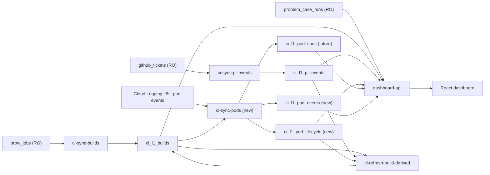

# CI Dashboard V2 Design

Status: Draft v0.4

Last updated: 2026-04-21

Reference inputs:
- `/Users/dillon/workspace/ee-apps-worktrees/ci-dashboard-v2/ci-dashboard/docs/ci-dashboard-v1-design.md`
- `/Users/dillon/workspace/ee-apps-worktrees/ci-dashboard-v2/ci-dashboard/docs/ci-dashboard-v2-pod-question-map.md`

## 1. Background

V1 made CI metrics production-usable with:
- formalized downstream build and PR-event tables
- hourly idempotent sync jobs on prow Kubernetes
- FastAPI + React dashboard for filter-based exploration

V2 extends observability depth. The objective is not only to show symptom metrics, but to identify where CI time and failures are introduced:
- environment preparation stage (Kubernetes pod lifecycle)
- build execution stage and failure evidence (Jenkins build and logs)

V1 can answer:
- how long a build waited
- how long a build ran

But V1 cannot explain why the wait happened.

For V1, `queue_wait_seconds` is effectively a black box. It may contain:
- pod scheduling delay
- image pull delay
- init-container overhead
- container startup delay
- a combination of multiple environment-side causes

V2.1 exists to decompose that black box into measurable environment stages so the dashboard can move from symptom reporting to operational diagnosis.

## 2. Decision: Pod Evidence First, But Jenkins GCP Coverage Stays In V2.1

V2 is still explicitly phased, but the boundary needs one important correction:

1. **V2.1 Pod evidence foundation**
- collect pod lifecycle and environment context
- cover both:
  - Prow-native pods that can already be reached directly from Cloud Logging
  - Jenkins GCP builds whose build identity can be resolved from pod labels and annotations fetched from Kubernetes API
- decompose build duration into actionable stages
- distinguish pre-ready vs post-ready failure concentration

2. **V2.2 Jenkins failure enrichment**
- collect broader Jenkins build metadata and failed console-log evidence
- classify failure categories/subcategories using richer Jenkins evidence

Reasoning:
- Pod-first still has the fastest path to operational value.
- But "pod-first" cannot mean "Prow-native only".
- For this environment, a large and important part of CI build volume is Jenkins-on-GCP.
- Therefore V2.1 must include Jenkins build linkage inside `sync-pods`, even though full Jenkins log classification remains a later phase.

## 2.1 Key Validated Constraint From Manual Verification

Manual validation on 2026-04-21 established five facts that materially change the design:

1. `ci_l1_builds.pod_name` is not the real Kubernetes pod name for sampled GCP Jenkins builds.
2. Sampled Jenkins agent pods expose stable metadata in Kubernetes `labels` and `annotations`, including `buildUrl`, `runUrl`, `ci_job`, `org`, `repo`, and Jenkins controller/label fields.
3. Those metadata fields are a stronger linkage source than `pod_name`, and console lookup is not required for the primary linkage path.
4. The real Jenkins agent pod does have `k8s_pod` lifecycle events in Cloud Logging.
5. Some Jenkins builds fan out into multiple agent pods, so the storage grain must remain one pod per row and build-level metrics must aggregate across matched pods.

Therefore the viable V2.1 path is:
- build in `ci_l1_builds`
- Cloud Logging pod event provides `namespace_name` and `pod_name`
- `sync-pods` uses `namespace_name + pod_name` only to fetch the pod object from Kubernetes API
- Jenkins linkage is then resolved from pod `annotations` and `labels`
- parsed build key matches a build row in `ci_l1_builds`
- every matched pod is stored as its own lifecycle row
- build-level metrics aggregate over all matched pod rows

## 2.2 Current Execution Focus

For the current V2 working round, we explicitly do **not** rush UI/chart work yet.

Immediate focus:
- finish multi-namespace `sync-pods` ingestion and inline Jenkins linkage on the data side
- define rollout/runbook and recovery steps
- define validation flow and validation cases
- wait for real production-like pod data before deciding final charts

Deferred until data exists:
- API payload design for pod panels
- chart composition and interaction details
- dashboard copy and visual refinement

## 3. Goals and Non-Goals

### 3.1 Goals

- add Kubernetes pod data collection for CI builds
- link pod-level lifecycle data to existing `ci_l1_builds`
- deliver dashboard panels that explain where startup/runtime time is spent
- keep all jobs idempotent and safe for range backfill
- preserve existing V1 behavior for users not using new V2 views

### 3.2 Non-Goals (for V2.1)

- no full-text indexing pipeline for all Jenkins logs yet
- no ML-driven auto-classification as a hard requirement
- no replacement of V1 flaky logic; V2.1 only adds environment evidence

## 4. Functional Requirements

### FR-01: Pod Event Collection

V2.1 must collect pod lifecycle event evidence for CI build pods with low impact to the production cluster.

Primary collection path for V2.1:
- Google Cloud Logging `k8s_pod` event logs
- not direct kube-apiserver polling as the primary path

Required namespace scope for Phase 1:
- `prow-test-pods`
- `jenkins-tidb`
- `jenkins-tiflow`

Optional namespace additions:
- other CI namespaces such as `jenkins-agents` if validation shows they carry build pods rather than controller-only noise

Reason:
- lower risk to the running prow cluster
- easier to operate as a CronJob
- event stream already contains the startup/scheduling reasons needed for first-phase timing decomposition

Required event-level fields:
- event reason (`Scheduled`, `Pulling`, `Pulled`, `Created`, `Started`, `FailedScheduling`, and similar scheduling/startup reasons)
- event message
- event timestamp
- receive timestamp
- involved pod identity (`pod_name`, `namespace`, `pod_uid` when available)

### FR-02: Jenkins Build Linkage From Pod Metadata

V2.1 must resolve Jenkins build identity from pod-side evidence without relying on Jenkins console or Jenkins API as the primary path.

Required inputs:
- `namespace_name`
- `pod_name`
- Kubernetes pod `labels`
- Kubernetes pod `annotations`
- existing `ci_l1_builds.url`
- existing `ci_l1_builds.normalized_build_key`

Required outputs:
- `build_system`
- stored raw pod metadata for audit:
  - `pod_labels_json`
  - `pod_annotations_json`
  - extracted Jenkins metadata such as `ci_job`, `jenkins_label`, `jenkins_controller`
- `jenkins_build_url_key`
- `source_prow_job_id` when a build row match is found
- `normalized_build_key` when a build row match is found
- linkage quality flags or parse status for audit/debug use

Compatibility rule:
- V2.1 must not assume `ci_l1_builds.pod_name` is reliable for all Jenkins GCP builds.
- The primary linkage path should be:
  - direct pod-name join for Prow-native pods
  - Cloud Logging pod identity -> Kubernetes pod metadata fetch -> labels/annotations-based linkage for Jenkins pods
- Jenkins console lookup is explicitly out of the primary V2.1 path.

### FR-03: Pod Lifecycle Timing Derivation

V2.1 must derive actionable pod-stage timing metrics from collected pod event and status evidence.

Initial timing definitions:

| Derived Field | Intended Meaning | Initial V2.1 Calculation |
|---|---|---|
| `schedule_wait_seconds` | time spent waiting for pod scheduling | `scheduled_at - pod_created_at` when both are available |
| `image_pull_seconds` | time spent pulling images | first matched `Pulled - Pulling` interval, or accumulated intervals when reliably reconstructable |
| `init_seconds` | time spent in init-container stage | `initialized_at - scheduled_at` when status timestamps are available |
| `container_start_seconds` | time from initialization to container readiness | `containers_ready_at - initialized_at` when status timestamps are available |
| `pod_ready_seconds` | total environment overhead before workload is ready | `ready_at - pod_created_at` when status timestamps are available |

Note:
- V2.1 does not require every formula to be available on day one.
- if only a subset is available from the chosen source path, the dashboard must surface the measurable subset first and leave the rest nullable.

### FR-04: Build-Pod Linking

V2.1 must link pod-derived data to existing `ci_l1_builds`.

Preferred linkage strategy is now path-specific:
- Prow-native path:
  - direct linkage by `pod_name`
- Jenkins GCP path:
  - use `namespace_name + pod_name` only to fetch the pod metadata
  - derive a normalized Jenkins build key from `annotations.buildUrl`, `annotations.runUrl`, or `labels + annotations` fallback fields such as `ci_job` and `jenkins/label`
  - match that key to `ci_l1_builds`
  - persist one pod lifecycle row per matched pod
- One-to-many rule:
  - one build may map to many pod lifecycle rows
  - build-level metrics aggregate over those rows at query time
- optional safety guard:
  - time-window checks when ambiguity is possible
  - explicit mismatch audits for parse failures or ambiguous matches

V2.1 must produce linkage-quality validation outputs so mismatches can be audited explicitly.

### FR-05: Pod-Derived Failure Signals

V2.1 should collect and normalize pod-side failure evidence that can later enrich build-level failure interpretation.

Priority signals:
- `FailedScheduling`
- `ImagePullBackOff` / image pull failures
- `OOMKilled`
- pod eviction
- container restart count greater than zero

V2.1 does not need to fully remap all build failure categories immediately, but it should preserve this evidence for later enrichment.

## 5. Scope

### 5.1 V2.1 In Scope (Pod-first)

- add pod ingestion job(s)
- add Jenkins build linkage parsing for GCP Jenkins pods
- add pod lifecycle downstream tables (`ci_*`)
- add build-pod linkage logic and quality checks
- define rollout/runbook for recurring sync and controlled backfill
- define validation flow and validation cases
- prepare, but do not rush-finalize, dashboard views for:
  - duration decomposition
  - pre-ready vs post-ready failure split
  - top jobs by pod preparation overhead

### 5.2 V2.2 In Scope (Jenkins phase)

- add Jenkins build metadata enrichment
- add failed build console-log ingestion (scope-controlled)
- add failure classification improvements using Jenkins evidence

### 5.3 Out of Scope (current iteration)

- replacing existing upstream ownership boundaries
- direct modification of source tables owned by other applications

## 6. Data Ownership and Source Boundaries

Read-only upstream tables remain unchanged:
- `prow_jobs`
- `github_tickets`
- `problem_case_runs`

V2 project-owned downstream tables remain writable by this project only:
- existing V1 `ci_l1_*` tables
- new V2 pod-related `ci_l1_*` tables
- future V2 Jenkins-related `ci_l1_*` tables

## 7. High-Level Architecture (V2)

## 8. V2.1 Question-to-Metric Coverage

Detailed mapping lives in:
- `docs/ci-dashboard-v2-pod-question-map.md`

V2.1 must answer at least:
1. What fraction of time is pod preparation in this scope?
2. Are failure-like builds concentrated before pod-ready or after?
3. Which jobs lose most time in pod preparation?
4. Is GCP pod-ready latency better than IDC under comparable weeks?

Before the dashboard answers these questions visually, the data layer must first pass:
- recurring sync readiness
- source-to-target event validation
- build-linkage quality checks
- freshness and idempotency checks

## 9. Proposed V2.1 Data Model

## 9.1 `ci_l1_pod_lifecycle` (required)

Purpose:
- pod lifecycle fact table aligned to build-level analytics

Proposed columns (draft):
- `id` PK
- `source_cluster`
- `namespace`
- `pod_uid`
- `pod_name`
- `build_system` (`PROW_NATIVE` / `JENKINS`)
- `jenkins_build_url_key` (nullable)
- `normalized_build_key`
- `source_prow_job_id` (nullable)
- `repo_full_name` (nullable denormalized)
- `job_name` (nullable denormalized)
- `node_name` (nullable)
- `pod_created_at`
- `scheduled_at` (nullable)
- `containers_ready_at` (nullable)
- `pod_ready_at` (nullable)
- `pod_startup_seconds` (derived)
- `schedule_seconds` (derived)
- `ready_seconds` (derived)
- `created_at`
- `updated_at`

Grain and relationship rule:
- one row per pod identity
- one build may have zero, one, or many pod lifecycle rows
- Jenkins fan-out is modeled directly rather than collapsed into a single synthetic row

Key indexes (draft):
- unique `(source_cluster, pod_uid)`
- index `(normalized_build_key)`
- index `(source_prow_job_id, pod_created_at)`
- index `(build_system, pod_created_at)`
- index `(jenkins_build_url_key)`
- index `(repo_full_name, pod_created_at)`
- index `(job_name, pod_created_at)`

Recommended additional lifecycle/failure fields to reserve in design even if some are populated later:
- `pod_created_at`
- `initialized_at`
- `containers_ready_at`
- `ready_at`
- `image_pull_seconds`
- `init_seconds`
- `container_start_seconds`
- `failed_scheduling_count`
- `oom_killed`
- `evicted`
- `restart_count`
- `termination_reason`

## 9.2 `ci_l1_pod_spec` (recommended)

Purpose:
- capture per-pod resource request/limit context

Proposed columns (draft):
- `pod_uid`
- `container_name`
- `request_cpu_millicores`
- `request_memory_bytes`
- `limit_cpu_millicores`
- `limit_memory_bytes`
- timestamps

## 9.3 `ci_l1_pod_events` (required in v2.1)

Purpose:
- keep event reason history for delay reason Pareto and root-cause drill-down

Proposed columns (draft):
- `pod_uid`
- `event_type`
- `event_reason`
- `event_message` (possibly truncated)
- `first_seen_at`
- `last_seen_at`
- `count`

Recommended future additions:
- `event_uid` when source provides stable event identity
- truncated but preserved scheduling/image-pull diagnostic messages

## 10. Job Design (V2.1)

New jobs:
1. `ci-sync-pods`
- incremental ingestion by time window + watermark
- collect from all agreed CI namespaces
- fetch metadata for touched Jenkins pods and resolve build linkage from labels/annotations
- idempotent upsert into pod tables

2. `ci-refresh-pod-derived` (optional if logic is heavy)
- precompute build-pod stage fields if query-time joins are too expensive

Scheduling target (initial):
- `ci-sync-pods`: every 10-15 minutes because Cloud Logging event retention is short
- `ci-refresh-pod-derived`: hourly
- support one-off range backfill job with controllable chunk size

Additional recommendation:
- keep the refresh cadence configurable
- no Jenkins console or Jenkins API dependency in the primary V2.1 ingestion path

## 11. API and Dashboard Additions (V2.1)

New API groups (draft):
- `/api/v1/pods/...` for lifecycle trends and rankings
- or integrated into existing page endpoints if response remains manageable

Dashboard additions (draft):
- Add to existing `CI Status` tab first:
  - `Build stage decomposition trend`
  - `Pre-ready vs post-ready failure split`
  - `Top pod-overhead jobs`

Possible follow-up:
- dedicated `Runtime Environment` tab if panel count exceeds readability

Future pod views that become possible once status/spec coverage improves:
- scheduling delay distribution
- image pull trend
- resource bottleneck table
- pod-side failure reason Pareto

## 12. Backfill and Idempotency

Requirements:
- all V2 jobs must support repeatable range backfill
- rerunning same window must converge to identical downstream state
- batch commits must avoid oversized transactions

## 13. Validation Strategy (Design-Level)

For V2.1 readiness, validation must include:
- Jenkins metadata-linkage quality:
  - percentage of Jenkins pod rows whose build key was resolved from annotations/labels successfully
  - sampled metadata-derived keys match build URLs
- linkage quality:
  - percentage of pod rows and builds matched to each other, split by build system
  - mismatch cases sampled and explained
- one-to-many aggregation sanity:
  - sampled multi-pod Jenkins builds aggregate as expected
- metric integrity:
  - duration decomposition sums reconcile with build total duration
- freshness:
  - pod data lag within agreed operational window

## 14. Open Decisions Requiring Confirmation

1. Status/snapshot enrichment depth:
- whether V2.1 stops at event-driven lifecycle first
- or also collects pod status/spec snapshots in the same phase

2. Jenkins pod metadata linkage policy:
- priority order between `buildUrl`, `runUrl`, and `ci_job + jenkins/label` fallback
- behavior when labels/annotations are missing or do not produce a unique build key

3. Event retention policy:
- how long to retain raw pod events vs rolled-up aggregates

4. UI placement:
- keep in `CI Status` first, revisit dedicated tab after user feedback

## 15. Pod Collection Strategy Evaluation (V2.1)

Based on current cluster inspection (`prow` on GKE):
- `gmp-system` collectors are already running
- `kube-state-metrics` is present
- `event-exporter-gke` is running in `kube-system`
- Cloud Logging `events` log for `k8s_pod` already contains pod lifecycle reasons such as:
  - `Scheduled`
  - `Pulling` / `Pulled`
  - `Created`
  - `Started`
  - `FailedScheduling`

### 15.1 Candidate Source Options

### Option A: Direct Kubernetes API (list/watch Pods + Events)

Pros:
- strongest real-time behavior
- no dependency on logging/monitoring ingestion delays

Cons:
- highest risk of API pressure on production cluster
- additional RBAC and failure-handling complexity
- watch lifecycle management and backfill complexity

Fit for current constraints:
- low on cluster-impact safety unless very carefully rate-limited

### Option B: Cloud Logging `events` as primary source (recommended)

Pros:
- already available with no new cluster-side deployment
- low impact to cluster API (read from logging backend)
- contains stage reason events needed by V2.1 (`Scheduled`, `Pulling`, `Started`, etc.)
- supports incremental read by timestamp / insert window

Cons:
- slight ingestion lag vs direct API watch
- requires careful normalization to avoid duplicate event rows

Fit for current constraints:
- strong: good timeliness and minimal cluster impact

### Option C: Managed Prometheus / Monitoring pod metrics as auxiliary source

Pros:
- low impact and already enabled
- useful for phase/state cross-check and trend aggregation

Cons:
- does not provide complete detailed stage timeline alone
- less suitable as sole evidence for per-build stage reconstruction

Fit for current constraints:
- good as secondary validation/enrichment, not primary lifecycle event source

### Option D: Build a new custom in-cluster collector

Pros:
- full control of schema and semantics

Cons:
- highest implementation and operational overhead
- unnecessary given current platform capabilities

Fit for current constraints:
- not recommended for V2.1

## 15.2 Recommended V2.1 Source Strategy

Use a hybrid strategy:

1. Primary ingestion:
- Cloud Logging `projects/<project>/logs/events` with `resource.type="k8s_pod"`
- parse lifecycle event reasons and timestamps into `ci_l1_pod_events`
- derive `ci_l1_pod_lifecycle` stage timestamps

2. Jenkins build linkage inside `sync-pods`:
- fetch pod metadata for touched Jenkins pods from Kubernetes API
- resolve Jenkins build identity from pod annotations and labels
- match the parsed build key to `ci_l1_builds`
- persist all matched pod rows directly into `ci_l1_pod_lifecycle`
- do not depend on Jenkins console lookup or Jenkins API in the primary V2.1 path

3. Auxiliary checks:
- Monitoring / GMP pod metrics for sanity checks and fallback trend-level validation

4. Strictly avoid:
- high-frequency full-cluster pod/event list scans against Kubernetes API server

## 15.3 Timeliness and Cluster-Impact Controls

To satisfy V2.1 requirements:

Timeliness controls:
- run `ci-sync-pods` every 10-15 minutes
- support configurable overlap window (for example, re-read last 10-20 minutes) to absorb logging latency
- keep watermark by log timestamp + insert id ordering

Cluster-impact controls:
- ingestion reads from Cloud Logging API (not from kube-apiserver)
- no cluster-wide watch stream in V2.1
- if any direct API fallback is used, it must be namespace-scoped and strongly rate-limited
