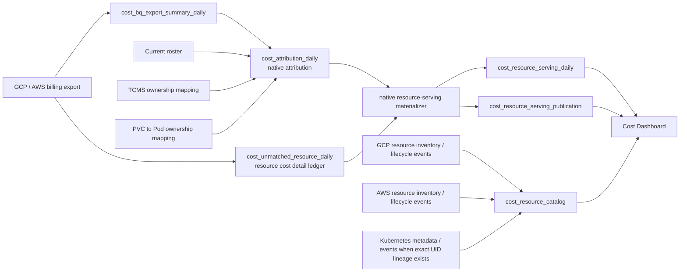

# Cost Dashboard Native Attribution and Resource Lifecycle Redesign

Status: Proposed
Date: 2026-09-02
Owners: Cost Insight (write path), CI Dashboard (read path)

## Summary

Cost Dashboard will expose one cost ownership model: **native attribution**.
It will retire user-facing Kubernetes residual allocation and Efficiency &
Quality (EQ) chargeback, including their materialized perspectives and
request-time fallback SQL.

Every Owner or Team cost with exact billing resource lineage must support
drilldown to the concrete billable resources behind that cost. Cost without
that lineage remains visible as an explicit fallback row. The resource view
defaults to `list_cost` and displays:

- stable resource identity and display name;
- provider labels;
- provider-reported creation and deletion timestamps when available;
- active/deleted lifecycle status;
- selected-period `list_cost`;
- Owner and current Team;
- explicit coverage and fallback information when concrete resource lineage is
  unavailable.

The irreducible facts are deliberately kept separate:

- billing answers **amount**;
- deterministic native attribution answers **Owner**;
- provider inventory/events answer **resource identity and lifecycle**;
- the current roster answers **Team**.

The serving projection and catalog exist only because Dashboard needs bounded,
paginated resource queries and provider metadata without querying high-cardinality
source ledgers online. Neither is a second cost authority or a universal
lifecycle registry. Billing first/last-seen dates and `usage_seconds` must not
be presented as resource creation, deletion, or lifetime.

The target flow is:



## Decision

### Cost ownership

Cost Dashboard uses only native attribution:

- Provider/billing ownership metadata, deterministic TCMS tag rules, and a
  deterministic PVC-to-Pod mapping resolve the source Owner and, when possible,
  its `employee_id`;
- the current roster maps a resolved `employee_id` to the employee's current
  Team; it does not rewrite the source Owner or cost;
- no cost is moved from one employee or Team to another after native ownership
  is determined;
- cost without a reliable Owner remains `(no owner)`;
- cost whose native Owner is EQ remains under EQ; this is not EQ chargeback;
- Kubernetes idle, system, and other residual cost remains under its native
  Owner or `(no owner)`; it is not reassigned by this design.

TCMS remains an ownership mapping. Despite existing `allocation` naming in
code and schema, selecting one matching ownership rule does not split cost and
is not the chargeback capability retired by this design.

### Team semantics

Team always means the employee's **current active roster group**. Historical
cost is intentionally shown under the current organization, not the
organization that existed on the usage date.

`employee_id` is the stable ownership key. Owner and Team APIs must not use an
email address, display name, or their hash as the durable identity.

Team is resolved by joining `employee_id` to the current active roster at read
time. Existing materialized `group_id` and `manager_id` columns may remain
during migration, but they are not authoritative for new Team resource
queries. A simple Team move therefore does not require rebuilding historical
resource facts.

A record without a matched `employee_id` may retain its source Owner label for
explanation, but its Team is `(no team)`.

### Cost metric

The resource list, sorting, coverage, and reconciliation default to
`list_cost`.

`effective_cost`, `credit_amount`, and `net_cost` remain persisted for audit
and possible future display, but they are not the primary resource-page
metric.

### Lifecycle semantics

Resource existence and lifetime mean provider-backed lifecycle:

```text
exists_from = provider creation timestamp
exists_to   = provider deletion timestamp or deletion event timestamp

lifetime = exists_to - exists_from,
           or current time - exists_from while the provider reports active
```

The UI may label these fields `Exists from` and `Exists to` (or `Created` and
`Deleted`), but only with the corresponding provider evidence. If the evidence
is missing, the field is `--`; an active status alone does not imply a creation
time, and a missing resource from a scan does not imply a deletion time.

The following are useful billing observations but are not lifecycle:

- first billed date;
- last billed date;
- number of billed days;
- billing `usage_seconds`;
- first or last inventory scan.

The UI must never label an inferred observation time as `Created`, `Deleted`,
or `Lifetime`.

## Motivation

### Allocation complexity does not have a confirmed consumer

The current implementation supports four perspectives:

| Dashboard basis | Serving basis |
| --- | --- |
| `current_attribution` | `native` |
| `residual_allocated` | `kubernetes_allocated` |
| `eq_allocated` | `eq_allocated` |
| `residual_eq_allocated` | `kubernetes_eq_allocated` |

That capability requires:

- provider-specific Kubernetes source and residual facts;
- allocation-group lineage;
- a global allocation version;
- staged Kubernetes and EQ materialization;
- four resource-serving perspectives;
- source replacement and amount-conservation rules;
- Dashboard basis selection and unavailable-basis fallback behavior.

There is no confirmed budgeting or chargeback workflow that depends on these
reassigned costs. The system therefore carries substantial write-path,
read-path, operational, and explanation cost without demonstrated product
value.

### Resource accountability is the stronger user need

Users need to answer:

```text
Which resources caused this Owner or Team's cost?
What are those resources called?
What labels do they have?
When were they actually created and deleted?
How much list cost did they produce in the selected period?
```

The existing resource view only partially answers this question:

- it is an Owner-only Top-10 view;
- it uses Owner display text as query identity;
- it labels billing `usage_seconds` as Duration;
- its `first_seen_date` and `last_seen_date` are bounded by the request window;
- labels are a representative billing value, not clearly the latest provider
  labels;
- it has no Team resource drilldown;
- it remains coupled to allocation basis and allocation publication state.

### Dynamic allocation fallback makes request cost unpredictable

When a published materialized allocation is unavailable, the Dashboard can
construct a residual-allocation CTE across attribution, Kubernetes allocation
facts, source mappings, and roster tables. Some endpoints execute basis
resolution before running the final aggregate, causing the same expensive
logic to be evaluated more than once.

The new contract is simpler:

- ordinary cost endpoints read native `cost_attribution_daily` only;
- resource endpoints read a published native resource-serving projection only;
- no request performs allocation, source replacement, or full conservation
  validation.

## Goals

1. Expose one explainable native cost ownership model.
2. Remove Kubernetes residual and EQ chargeback from Dashboard behavior.
3. Make every Owner and Team cost segment with exact resource lineage
   drillable to a paginated resource list, while exposing other cost as an
   explicit fallback.
4. Reconcile published resource `list_cost` to native attribution `list_cost`.
5. Show provider-backed lifecycle without conflating it with billing
   observation time.
6. Use stable resource and employee identities in APIs.
7. Keep missing resource detail or lifecycle explicit instead of fabricating a
   concrete resource or timestamp.
8. Keep request-time queries bounded to published serving rows, current roster,
   and a small resource catalog.
9. Preserve provider-native Kubernetes metadata that helps ownership,
   filtering, and explanation.
10. Permit staged publication so failed jobs never expose partial daily data.

## Non-goals

- Building a full Kimball ODS/DIM/DWD/DWS stack.
- Building a general-purpose CMDB.
- Reconstructing lifecycle from billing dates.
- Guaranteeing lifecycle for fees, credits, network egress, support charges, or
  other billing rows that do not represent a real provider resource.
- Reallocating shared infrastructure cost to consumers.
- Preserving historical Team membership.
- Querying raw high-cardinality billing/resource ledgers from Dashboard.
- Adding a generic inventory-adapter framework before concrete GCP and AWS
  sources are validated.
- Dropping existing allocation tables in the first rollout step.

## Terminology

| Term | Definition |
| --- | --- |
| **native attribution** | Deterministic assignment of a source billing fact to its source Owner using provider/billing ownership metadata, TCMS ownership rules, and PVC/Pod ownership metadata. The current roster then resolves the matched employee's current Team. It never moves cost between Owners after assignment. |
| **allocation** | Redistribution of an already attributed cost to another workload, Owner, or Team. Kubernetes residual allocation and EQ chargeback are allocation. |
| **summary source fact** | One row in `cost_bq_export_summary_daily`, identified for downstream lineage by `source_summary_row_hash`. |
| **resource detail** | A resource/SKU-level billing row in `cost_unmatched_resource_daily`. The historical table name is retained initially even though the table serves all resource drilldowns. |
| **resource-serving fact** | A daily, native Owner/resource aggregate in `cost_resource_serving_daily`, used by Dashboard instead of joining source ledgers online. |
| **canonical resource ID** | Provider-scoped stable resource identifier, such as a GCP full resource name, AWS ARN, or Kubernetes UID. |
| **resource key** | Stable serving/API identity across the selected period. A concrete resource key is derived from canonical identity; a billing-only or fallback key is deterministic, non-catalog, and not a promise of provider identity. |
| **resource catalog** | One-row-per-provider-resource metadata table containing identity, latest labels, and provider lifecycle. |
| **fallback** | Synthetic serving row that preserves source cost when no exact concrete resource detail is available. It is visibly marked and has no provider lifecycle. |
| **current Team** | The active roster group of the matched `employee_id` at query time. |
| **billing observation** | First/last billed date or billed usage duration. It is not provider lifecycle. |

## Source-of-truth boundaries

| Question | Source of truth |
| --- | --- |
| How much did a billing fact cost? | Billing export summary/detail. |
| Which source Owner does the fact belong to? | Deterministic native attribution rules over provider/billing ownership metadata, TCMS rules, and PVC/Pod metadata. |
| Which concrete resource generated the cost? | Exact summary-to-resource billing lineage. |
| What is the resource's stable identity? | Provider canonical resource ID. |
| When was it created/deleted? | Provider inventory or lifecycle events. |
| What Team owns the matched employee now? | Current active roster. |
| Which labels are current? | Latest provider inventory metadata. |
| Which labels were present in billing? | Billing resource detail. |

No source may silently answer a question owned by another source. In
particular, billing dates do not answer lifecycle questions, and inventory
metadata does not replace billing amounts.

## Target architecture

### 1. Billing summary ledger

`cost_bq_export_summary_daily` remains the authoritative compact source ledger
for daily cost attribution.

It retains provider-native dimensions such as:

- service, SKU, usage type, and cost driver;
- region;
- repository and target branch;
- namespace and workload metadata;
- provider-native scope metadata;
- source Owner/service/project metadata;
- all four monetary measures.

Removing derived allocation does not remove provider-native Kubernetes or
source split-cost fields from this table; those fields describe the billing
fact and are not a post-attribution redistribution.

### 2. Native attribution fact

`cost_attribution_daily` remains the authoritative Owner-level cost fact.

Its important target contract is:

```text
usage_date
vendor / account_id
source_summary_row_hash
attribution_key
owner
employee_id
attribution_source
attribution_status
list_cost / effective_cost / credit_amount / net_cost
```

Owner attribution is calculated once here and inherited by resource-serving
rows. Resource importers must not independently reimplement roster or TCMS
matching.

For Team views, `employee_id` joins to the current active roster. Stored
`group_id` and `manager_id` remain compatibility data until every relevant
Dashboard query uses the agreed current-roster contract.

### 3. Resource detail ledger

`cost_unmatched_resource_daily` remains the audit ledger for concrete billing
resource details. A physical rename is deferred to avoid a migration that adds
no product value.

The importer must retain:

```text
vendor / account_id / usage_date
source_summary_row_hash
canonical_resource_id
resource_type
resource_name
parent_resource_name
region
service / SKU
billing labels
usage_seconds
list/effective/credit/net cost
```

`source_summary_row_hash` is the equality lineage between native attribution
and resource detail. It must continue to be calculated by the same canonical
summary identity helper used by the summary importer.

### 4. Native resource-serving fact

The implementation should simplify the existing
`cost_resource_serving_daily` in place rather than create a second serving
fact.

Target grain:

```text
materialization_version
+ usage_date
+ vendor / account_id
+ attribution_key
+ employee_id (nullable)
+ resource_key
+ service_name
+ target_branch
```

`resource_key` is the serving/API identity used to aggregate across service
and SKU rows. For a concrete resource it is stable across the selected period;
for a billing-only or fallback row it is only a deterministic non-catalog key.

Important target fields:

| Field | Purpose |
| --- | --- |
| `materialization_version` | Staged daily version selected by publication pointer. |
| `usage_date` | Billing usage date. |
| `vendor`, `account_id` | Cost source. |
| `attribution_key` | Stable attribution bucket, including unmatched/no-owner cases. |
| `employee_id` | Stable matched employee identity; nullable. |
| `owner` | Display/audit label, not API identity. |
| `attribution_source`, `attribution_status` | Explain how ownership was determined. |
| `resource_group_key` | Stable identity for a concrete resource across service/SKU rows; nullable when the source has no canonical provider identity. |
| `resource_key` | Stable serving/API identity across the selected period. For concrete rows it equals `resource_group_key`; billing-only and fallback rows use explicit non-catalog keys. |
| `canonical_resource_id` | Provider identity used to join the catalog. |
| `resource_type` | Provider resource type. |
| `resource_name`, `parent_resource_name` | Display metadata. |
| `service_name`, `target_branch` | Supported filters. |
| `representative_billing_labels_json` | Deterministic billing labels for the daily aggregate. |
| `metadata_variant_count` | Number of distinct billing metadata variants collapsed into the row. |
| `detail_list_cost` | Cost backed by concrete resource detail. |
| `fallback_list_cost` | Cost without concrete detail. |
| `list_cost` | `detail_list_cost + fallback_list_cost`. |
| other monetary fields | Audit/reconciliation measures. |

After all readers use native-only serving data, remove or stop depending on:

- `basis_key`;
- allocation-group lineage;
- `source_allocation_version`;
- derived-basis materialization branches.

During rolling migration, `basis_key='native'` may remain physically present.
The Dashboard must nevertheless stop accepting or selecting another basis.

### 5. Resource catalog

Add one compact table, logically named `cost_resource_catalog`, with one row per
real provider resource.

Target grain:

```text
vendor + account_id + resource_type + canonical_resource_id
```

The hash of that scoped identity is stored as `resource_group_key` and is the
catalog key.

Logical fields:

| Field | Meaning |
| --- | --- |
| `resource_group_key` | SHA-256 of the scoped `(vendor, account_id, resource_type, canonical_resource_id)` tuple. |
| `vendor`, `account_id` | Provider scope. |
| `resource_type` | Provider type, for example `compute.googleapis.com/Instance`. |
| `canonical_resource_id` | Full provider identifier. |
| `resource_name` | Human-readable display name. |
| `parent_resource_id` | Stable parent ID when available. |
| `region` | Provider location. |
| `provider_created_at` | Exact provider creation timestamp when available. |
| `provider_deleted_at` | Exact provider deletion/event timestamp when available. |
| `lifecycle_status` | `active`, `deleted`, or `unknown`. |
| `lifecycle_completeness` | `provider_exact` (authoritative creation/deletion evidence), `created_exact` (authoritative creation only), `observed_only` (identity/status observed but no exact lifecycle timestamp), or `unavailable`. |
| `lifecycle_source` | Source such as GCP Asset Feed, AWS Config, CloudTrail, or Kubernetes event. |
| `last_inventory_observed_at` | Operational freshness only; never used as deletion time. |
| `labels_json` | Latest provider labels, or final observed labels for a deleted resource. |
| `labels_observed_at` | Timestamp of the label snapshot. |

This is a resource catalog, not a second cost fact and not a general CMDB. It
contains only resources needed by Cost Dashboard.

### 6. Publication pointer

Keep the existing version-and-pointer publication pattern for resource-serving
rows. It prevents a failed or restarted materialization from exposing partial
data.

The native-only publication grain becomes:

```text
vendor + account_id + usage_date
```

Target fields:

```text
active_materialization_version
source_row_count
serving_row_count
detail_list_cost
fallback_list_cost
total_list_cost
published_at
tiflash_ready_at
```

Retain `tiflash_ready_at` as the publication-readiness gate through native
cutover: a pointer is active only after the staged serving version has passed
the existing TiFlash readiness check. It is not a Dashboard query-time join or
an allocation selector. Retire the field only after the bounded/indexed read
path has been validated and no reader depends on the gate.

Remove allocation-specific publication state after cutover:

- `basis_key` as a semantic selector;
- `source_allocation_version`;
- dependency on the global `cost_allocation_publication` pointer.

Dashboard trusts a successfully published pointer. It must not join the entire
serving table to recompute row counts or rerun conservation checks during a
request.

## Canonical resource identity

### Identity rule

For a concrete provider resource, the stable resource identity is:

```text
resource_group_key = SHA256(
  vendor,
  account_id,
  resource_type,
  canonical_resource_id
)
```

A billing-only or fallback row has no provider identity and therefore has no
catalog `resource_group_key`; its `resource_key` is only a deterministic
serving key derived from source lineage, stable across usage dates within a
query period (not from the materialization date).

`resource_name` is display data and must not be the primary durable identity.
Names can collide across regions, be reused after deletion, and change while a
resource remains the same.

### Preferred provider identities

| Source | Preferred canonical identity |
| --- | --- |
| GCP | Cloud Asset full resource name / billing `resource.global_name`. |
| AWS | ARN; otherwise account + region + resource type + provider resource ID. |
| Kubernetes | cluster identity + namespace + kind + UID. |

### Billing-to-catalog mapping

Resource detail importers must persist the canonical identity directly from the
source whenever possible. The resource-serving materializer copies it into the
serving fact. For concrete rows, Dashboard then performs an equality join:

```text
cost_resource_serving_daily.resource_group_key
=
cost_resource_catalog.resource_group_key
```

Dashboard must not use fuzzy name matching between billing and inventory.

When the billing source exposes only a display name and no stable provider ID:

- the cost row remains visible;
- it receives a deterministic billing-only resource key scoped to its source
  lineage and serving window;
- `lifecycle_completeness='unavailable'`;
- the UI displays `Lifecycle unavailable`;
- it is never attached to a catalog row by heuristic matching or presented as
  a provider-identified resource.

## Lifecycle collection

### GCP

Preferred source order:

1. Cloud Asset Inventory/Feed with full resource identity and event history;
2. provider resource API for types with an exact creation timestamp;
3. `unavailable` when neither gives reliable lifecycle.

A current-asset listing alone can establish that a resource is active and may
provide its creation time. Disappearance from a listing does not establish an
exact deletion timestamp. Exact deletion requires a provider history or event
source.

### AWS

Preferred source order:

1. AWS Config resource history, when enabled for the account/type;
2. CloudTrail create/delete events;
3. provider resource APIs such as EC2/EBS/RDS for exact creation metadata;
4. `unavailable` when no reliable source exists.

AWS Resource Tagging or Resource Explorer data may supply identity and labels,
but must not be assumed to provide a complete cross-service lifecycle.

### Kubernetes

Kubernetes lifecycle is supported only when billing/resource lineage contains
or can deterministically resolve a UID. The preferred source is Kubernetes API
metadata plus watch/audit events.

Workload names without UID lineage are not sufficient because names can be
reused. Removing Kubernetes cost allocation does not remove native namespace,
workload, author, or PVC/Pod metadata that supports deterministic attribution.

### Correctness rules

1. `provider_created_at` is written only from provider metadata or a creation
   event.
2. `provider_deleted_at` is written only from provider metadata or a deletion
   event.
3. A missing resource in one inventory scan never sets `provider_deleted_at`.
4. Inventory watermarks advance only after a complete successful scan/feed
   checkpoint.
5. Provider-exact timestamps are monotonic and cannot be replaced by weaker
   observed timestamps.
6. A later exact event may upgrade `observed_only` to `provider_exact`.
7. Unsupported resources remain visible with lifecycle marked unavailable.

### Initial support matrix

The rollout should start with high-cost resource types that expose reliable
identity and lifecycle, then expand by measured cost coverage:

| Initial target | Expected source |
| --- | --- |
| GCP Compute instances and disks | Cloud Asset / Compute metadata and lifecycle events. |
| AWS EC2 instances and EBS volumes | AWS Config/CloudTrail plus EC2 APIs. |
| GKE/EKS workload resources with exact UID lineage | Kubernetes metadata and events. |
| Other provider resources | Visible cost; lifecycle explicitly unavailable until supported. |
| Non-resource billing charges | Visible as non-resource/fallback cost; no lifecycle applies. |

This support matrix must be validated against actual account permissions,
source retention, and observed identifier/timestamp evidence before a resource
type is marked supported. Until then, its cost remains visible but lifecycle is
explicitly unavailable; this design makes no universal lifecycle-coverage
claim.

## Native resource cost expansion

### Equality lineage

For each native attribution source fact, load resource details by:

```text
vendor
+ account_id
+ usage_date
+ source_summary_row_hash
```

No nullable-dimension or JSON comparison is allowed in the permanent
materializer.

### Concrete detail

When resource detail is complete and reconciles to its summary source, retain
the resource detail's monetary values directly. Do not redistribute one
resource's cost to another resource merely to make the display look complete.

Example:

```text
native source list cost                 100
resource A detail list cost              30
resource B detail list cost              50
resource C detail list cost              20
published concrete resource total       100
```

### Partial detail

When concrete resource details explain less than the source:

```text
native source list cost                 100
concrete resource detail                 80
attribution fallback                     20
```

The fallback row:

- is identified as `attribution_fallback`;
- is labeled `(resource detail unavailable)`;
- has no provider lifecycle;
- remains under the same native Owner;
- contributes to fallback and coverage metrics.

### Detail overage

If concrete resource detail exceeds its source beyond
`COST_RESOURCE_DETAIL_OVERAGE_TOLERANCE` (an absolute `list_cost` amount per
vendor/account/date, configured by the materializer deployment), the
materializer must not silently scale resource rows down or publish the window. The likely cause is a mismatched export partition,
late-arriving correction, duplicate detail, or broken summary identity.

The job records the mismatch and retries after source data is repaired or
reimported with aligned windows.

### Conservation invariant

For every published vendor/account/date, and preferably for each source fact:

```text
SUM(native attribution list_cost)
=
SUM(resource detail list_cost)
+
SUM(resource fallback list_cost)
```

The same invariant remains checked for effective, credit, and net values for
audit even though `list_cost` is the default UI measure.

Conservation is an offline publication gate, not a Dashboard query.

## Labels

Two label concepts are kept separate.

### Provider labels

`cost_resource_catalog.labels_json` contains the latest provider-observed
labels, or the final provider-observed labels before deletion. These are the
default labels shown in the resource list.

### Billing labels

Resource detail and serving rows preserve the labels attached to billing rows
in the selected period. These remain useful for:

- explaining attribution;
- auditing delayed or changed labels;
- showing historical label variants.

If multiple billing label variants are collapsed into one daily serving row,
the materializer stores a deterministic representative value and
`metadata_variant_count`. The resource detail view may expose the distinct
billing variants, but the initial list view does not require a separate label
history table.

The UI labels provider and billing metadata explicitly; it does not merge them
into one ambiguous value.

## Dashboard API design

### Remove allocation basis

The following APIs stop accepting or acting on `allocation_basis`:

- `/api/v1/pages/cost-trend`;
- `/api/v1/pages/cost-share`;
- `/api/v1/pages/cost-repo-group-stack`;
- `/api/v1/pages/cost-engineering-group-share`;
- resource drilldown APIs.

During one compatibility release, the server may accept
`allocation_basis=current_attribution` and ignore it. Any other value returns a
clear validation error rather than silently falling back.

The Dashboard removes `_cost_allocation_basis()`, the residual allocation CTE,
materialized allocation-basis resolution, and basis availability notices after
all callers have cut over.

### Resource list endpoint

Replace the Owner-only Top-10 semantics with a stable, paginated endpoint:

```http
GET /api/v1/pages/cost-resources
    ?scope_type=owner|team
    &scope_id=<employee_id|group_id>
    &start_date=YYYY-MM-DD
    &end_date=YYYY-MM-DD
    &cost_source=<vendor:account>
    &service_name=<optional>
    &sort_by=list_cost
    &page_size=50
    &cursor=<optional>
```

Rules:

- default and initial supported `sort_by` is `list_cost` (descending), with
  deterministic `resource_key ASC` tie-breaking; lifetime sorting is deferred
  until its null and time-dependent semantics are useful;
- maximum request window remains bounded initially;
- default page size is 50 and maximum is 100;
- Owner scope uses `employee_id`, or an explicit attribution key for
  `(no owner)`/unmatched buckets;
- Team scope uses active `roster_employees.group_id` and then filters serving
  rows by the matched employee IDs;
- returned cost is selected-period `list_cost`, not lifetime cost;
- pagination replaces the current `LIMIT 10` product contract;
- the response includes pending publication dates and coverage totals;
- a catalog miss does not hide the cost row.

Representative response item (a concrete row; billing-only/fallback rows
set `canonical_resource_id` and lifecycle fields to `null` and identify their
non-catalog `resource_data_source`):

```json
{
  "resource_key": "...",
  "canonical_resource_id": "projects/.../instances/instance-1",
  "resource_name": "instance-1",
  "resource_type": "compute.googleapis.com/Instance",
  "vendor": "gcp",
  "account_id": "pingcap-testing-account",
  "service_names": ["Compute Engine"],
  "list_cost": 123.45,
  "owner": {
    "employee_id": 123,
    "name": "..."
  },
  "team": {
    "group_id": 456,
    "name": "..."
  },
  "lifecycle": {
    "status": "active",
    "exists_from": "2026-08-01T10:30:00Z",
    "exists_to": null,
    "completeness": "created_exact",
    "source": "gcp_asset_inventory"
  },
  "provider_labels": {},
  "resource_data_source": "resource_detail",
  "resource_detail_cost": 123.45
}
```

### Resource detail endpoint

The API names provider-backed lifecycle timestamps `exists_from` and
`exists_to`; storage names such as `provider_created_at` are implementation
details. A non-catalog billing-only or fallback `resource_key` returns no
provider resource detail rather than inventing identity.

```http
GET /api/v1/pages/cost-resources/{resource_key}
    ?start_date=YYYY-MM-DD
    &end_date=YYYY-MM-DD
```

It returns:

- canonical identity, name, type, parent, location, and provider;
- provider labels and their observation timestamp;
- provider-backed `exists_from`/`exists_to` fields and source/completeness;
- selected-period list cost;
- daily list-cost trend;
- native Owner and current Team;
- attribution source/status;
- billing label variants when available;
- concrete-detail and fallback coverage.

A fallback row may be listed for reconciliation but has no resource-detail
page pretending it is a cloud resource.

### Stable drilldown identities

Owner and Team share responses must add stable drilldown metadata:

```json
{
  "name": "display name",
  "value": 123.45,
  "scope_type": "owner",
  "scope_id": "123",
  "interactive": true
}
```

The frontend must not send `item.name` back as the identity.

## Dashboard UI design

### Remove

- allocation-basis segmented controls;
- `Native`, `K8S allocated`, `EQ allocated`, and `K8S + EQ allocated` labels;
- allocation unavailable/fallback notices;
- Kubernetes allocated/unallocated summary card;
- Engineering Group allocation wording;
- K8s and EQ chargeback-specific resource behavior.

### Keep and rename

- Cost breakdown continues to default to `list_cost`;
- Owner and Team share views remain interactive;
- `Engineering Group allocation` becomes native `Engineering Group cost
  share` if the panel remains useful;
- `Resource breakdown` becomes a complete resource list rather than an
  unmatched-resource investigation view.

### Resource list columns

The initial resource list displays:

| Column | Meaning |
| --- | --- |
| Resource | Provider display name and type. |
| List cost | Selected-period `list_cost`; default sort descending. |
| Status | `lifecycle_completeness=unavailable` renders `Lifecycle unavailable`; otherwise render `lifecycle_status` as Active, deleted, or unknown. |
| Exists from | Provider creation time or `--`. |
| Exists to / Active | Provider deletion time, `Active`, or `Unknown`; never billing last seen. |
| Lifetime | Derived only when creation time is exact; otherwise `--`. |
| Service | Distinct billing services. |
| Labels | Latest provider labels. |
| Owner | Included in Team scope. |
| Coverage | Concrete detail or fallback indicator. |

The current `Duration` column based on billing `usage_seconds` is removed or
renamed to `Billed usage` and moved to the resource detail view. It must not be
used as lifecycle.

For deterministic status rendering, `lifecycle_completeness=unavailable`
always takes precedence over `lifecycle_status` and displays `Lifecycle
unavailable`; otherwise `active`, `deleted`, and `unknown` display as Active,
deleted, and unknown respectively, including for `observed_only` completeness.

### Drilldown behavior

- clicking an Owner share opens Owner resources;
- clicking a Team share opens Team resources;
- Team results show the current Owner for each resource;
- clicking a concrete resource opens its detail view;
- users can page beyond the first ten resources;
- `(resource detail unavailable)` is visible but not clickable as a cloud
  resource;
- pending publication returns an explicit retry state, not a legacy broad
  query.

## Query and index design

The read path must remain bounded:

```text
published native serving rows in selected dates
+ current roster employee/group mapping
+ resource catalog lookup for one result page
```

It must not read `cost_unmatched_resource_daily`, calculate attribution, or
perform a full-window conservation check in a request. The serving projection
exists only to make this bounded page query possible; it is not a general
resource warehouse.

Candidate serving indexes:

```text
(employee_id, usage_date, vendor, account_id)
(resource_group_key, usage_date)
(vendor, account_id, usage_date, attribution_key)
```

The exact order should be selected from production `EXPLAIN ANALYZE` evidence.
Do not add all possible permutations before measuring.

A Team query first resolves the small set of active employee IDs in the group,
then reads serving rows through the employee/date index. Resource metadata is
joined after the resource cost aggregation has been limited to one page.

The catalog lookup is by `resource_group_key` primary key. No JSON or fuzzy
resource-name join is permitted.

Publication validation is one bounded pointer lookup per expected
vendor/account/date. Dashboard does not recompute `serving_row_count` or cost
conservation.

## Jobs

### Keep

- GCP and AWS billing summary sync;
- GCP and AWS resource detail sync;
- `refresh-cost-attribution-from-summary`;
- `materialize-resource-serving`, simplified to native only;
- roster sync and deterministic ownership metadata inputs;
- provider-native Kubernetes metadata used for attribution;
- PVC-to-Pod ownership mapping where it deterministically identifies the
  source Owner.

### Add

Use simple provider-specific collectors rather than a speculative generic
framework:

- GCP resource catalog/lifecycle sync;
- AWS resource catalog/lifecycle sync;
- optional Kubernetes lifecycle sync only for exact UID-linked resources.

Each job must be resumable by provider/account checkpoint and safe to replay.

### Stop scheduling

- `sync-gcp-kubernetes-workload-allocations`;
- `sync-aws-kubernetes-workload-allocations`;
- `sync-aws-parent-residual-allocations`;
- `materialize-cost-allocations` and allocation publication.

Schedules live partly in the external `ee-ops` repository and must be removed
only after Dashboard and resource-serving readers have cut over.

### Simplify attribution invalidation

`refresh-cost-attribution-from-summary` no longer invalidates a global cost
allocation publication. It invalidates only affected native resource-serving
windows when ownership identity changes.

A roster-only Team move should not require resource-serving rematerialization
when Team is resolved from `employee_id` at read time. Changes that alter
Owner-to-employee matching still require attribution and affected serving
windows to rebuild.

## Tables to retire

After the read and write cutovers are proven, stop writing and then remove:

- `cost_kubernetes_workload_allocation_daily`;
- Kubernetes allocation source/group lineage tables introduced for derived
  replacement;
- `cost_aws_parent_residual_allocation_daily`;
- `cost_allocation_daily`;
- `cost_allocation_publication`.

Any remaining provider-native Kubernetes columns in summary, attribution, and
resource detail tables are retained. Their presence does not imply derived
allocation.

The physical table drop is a separate migration after at least one successful
billing correction/reimport cycle and confirmation that neither `ee-apps` nor
`ee-ops` references the retired jobs or tables.

## Publication and failure behavior

For each vendor/account/date:

1. load native attribution source rows;
2. load exact-lineage resource detail rows;
3. construct concrete and fallback serving rows;
4. validate row identities and all amount invariants;
5. write a private `materialization_version`;
6. persist publication counts and cost totals;
7. atomically move the publication pointer;
8. asynchronously remove obsolete versions after a safe retention period.

If a step fails:

- the prior published version remains active for that vendor/account/date;
- no partial new version is visible;
- the job state records the failed source window and reason;
- Dashboard serves the prior version only when one exists, and marks it stale;
  a date with no published version is returned as pending;
- Dashboard never falls back to the raw source-ledger join. A configured
  freshness limit may make stale data unavailable rather than silently extend
  its validity.

## Data quality and observability

### Required offline checks

For every candidate publication:

- source attribution row count is recorded;
- serving row count is nonzero when source row count is nonzero;
- resource detail and fallback list costs sum to native list cost;
- other monetary fields conserve independently;
- every concrete row has a deterministic resource key;
- every exact catalog join uses canonical identity;
- no fallback row claims a provider lifecycle;
- no observed-only timestamp is stored as provider deletion time.

### Operational metrics

Track by vendor/account/date and resource type:

- published native serving windows;
- pending/failed windows;
- concrete resource-detail `list_cost` coverage;
- fallback `list_cost` and percentage;
- canonical resource-ID coverage;
- catalog join coverage;
- provider-exact lifecycle cost coverage;
- created-only lifecycle cost coverage;
- lifecycle-unavailable cost coverage;
- catalog and billing freshness lag.

Coverage is cost-weighted by `list_cost`, with row-count metrics retained for
debugging. A small number of high-cost missing resources matters more than many
zero-cost rows.

### User-visible metadata

Resource responses include:

- `resource_detail_coverage_pct`;
- pending dates;
- lifecycle completeness and source;
- catalog freshness;
- selected metric (`list_cost`).

This prevents the UI from implying completeness that the source data cannot
support.

## Security and permissions

Lifecycle collectors use read-only cloud permissions scoped to the configured
billing accounts/projects. They must not mutate cloud resources.

Before implementation, validate:

- GCP Asset Inventory/Feed access and retention;
- AWS Config/CloudTrail availability and cross-account role permissions;
- Kubernetes cluster access for UID/event metadata;
- whether lifecycle events contain sensitive labels that need filtering before
  storage or display.

Dashboard continues to read TiDB only; it does not call provider APIs during a
user request.

## Migration plan

### Phase 0: evidence and source readiness

1. Measure current native versus allocated Top-N Owner/Team differences to
   document the product impact of removal.
2. Inventory active `ee-ops` schedules and table readers.
3. Validate canonical ID availability in GCP/AWS resource detail exports.
4. Validate GCP and AWS lifecycle sources and retention.
5. Define the first supported resource-type matrix.

Exit criteria:

- no unknown production consumer requires K8s/EQ allocated cost;
- lifecycle permissions and exactness are documented per initial resource type.

### Phase 1: native Dashboard read cutover

1. Remove allocation selectors and allocation-only cards from the UI.
2. Make trend/share/stack/engineering queries read native attribution directly.
3. Stop request-time residual CTE fallback.
4. Reject non-native allocation-basis requests during compatibility rollout.
5. Rename user-facing allocation wording to attribution/cost share.

Allocation jobs and tables remain untouched for rollback during this phase.

Exit criteria:

- all Cost Dashboard pages use native attribution only;
- production requests execute no allocation CTE;
- native totals match pre-cutover native totals.

### Phase 2: native resource-serving cutover

1. Persist canonical resource IDs, `resource_type`, and `parent_resource_name`
   in billing resource detail, then add stable `employee_id`, attribution
   metadata, canonical identity, and parent/type fields to resource-serving
   output. This must precede native serving publication because concrete
   `resource_group_key` values are derived from the persisted provider identity.
2. Simplify materialization to native source rows only.
3. enforce direct-detail plus explicit-fallback list-cost conservation.
4. simplify publication to native daily pointers.
5. add Owner and Team stable-ID queries and pagination.
6. retire the Owner-name Top-10 API behavior.

Exit criteria:

- every Owner/Team share item has a stable `resource_key` drilldown identity
  backed by its persisted canonical identity when the source provides one;
- maximum-window resource queries do not read the raw resource ledger;
- published list-cost conservation passes for all active source windows;
- `(no owner)` and largest Team queries do not produce gateway 504s.

### Phase 3: lifecycle catalog

1. Create `cost_resource_catalog` and backfill it from the canonical identities
   persisted in billing resource detail and resource-serving rows.
2. deploy GCP and AWS catalog/lifecycle collectors for the approved type
   matrix;
3. join catalog metadata after paginated cost aggregation;
4. replace billing Duration with provider lifecycle fields;
5. expose lifecycle completeness and unavailable states.

Exit criteria:

- supported resource types show provider-backed timestamps;
- unsupported types never show billing observations as lifecycle;
- catalog join and exact-lifecycle cost coverage are measured.

### Phase 4: stop derived allocation writes

1. remove K8s/EQ allocation jobs from `ee-ops` schedules;
2. stop allocation publication;
3. remove derived resource-serving basis runs;
4. monitor one complete billing correction/reimport cycle;
5. confirm no runtime reads allocation tables.

### Phase 5: schema and code retirement

1. remove allocation CLI commands, job modules, API helpers, tests, and config;
2. drop allocation tables and allocation-only lineage after the observation
   period;
3. remove compatibility `basis_key` and `source_allocation_version` columns;
   rename the existing serving `representative_labels_json` column to
   `representative_billing_labels_json`;
4. update system diagrams and mark superseded allocation docs as historical;
5. optionally rename `cost_unmatched_resource_daily` in a separate migration
   only if the operational value exceeds migration risk.

## Rollback

Before Phase 4, rollback is:

- redeploy the prior Dashboard version;
- resume existing allocation schedules;
- continue using preserved allocation tables/publications.

After allocation tables are dropped, rollback requires rebuilding those facts
from source billing and allocation logic. Therefore physical deletion is
intentionally separated from the user-facing cutover.

Resource catalog rollout is independently reversible because it enriches
resource responses but does not determine billing cost or native Owner.

## Testing strategy

### Cost Insight

Unit/integration coverage must include:

1. canonical resource key stability and provider scoping;
2. exact summary-to-detail lineage;
3. direct detail list-cost preservation;
4. explicit fallback for partial/missing detail;
5. publication rejection on detail overage;
6. conservation for all monetary measures;
7. native-only publication pointer behavior;
8. current/previous version visibility during a failed run;
9. lifecycle timestamp source precedence;
10. missing inventory scan does not create a deletion timestamp;
11. exact events upgrade weaker lifecycle data without downgrading exact data;
12. catalog replay idempotency.

### CI Dashboard API

Coverage must include:

1. all cost endpoints ignore/remove derived allocation behavior;
2. non-native compatibility requests fail clearly;
3. Owner resource query uses stable employee identity;
4. Team query uses current active roster membership;
5. moved employees appear under the current Team without rewriting billing
   cost;
6. paginated resource ordering defaults to `list_cost DESC` with deterministic
   tie-breaking;
7. selected-period resource list cost sums to the published scope total;
8. catalog miss returns lifecycle unavailable without dropping the cost row;
9. fallback rows are explicit and non-clickable as real resources;
10. pending publication never triggers the legacy broad query;
11. provider and billing labels remain distinguishable.

### Frontend

Coverage must include:

- no allocation selector or derived allocation card;
- Owner and Team share drilldowns use stable IDs;
- resource pagination;
- default list-cost ordering;
- `lifecycle_completeness=unavailable` renders `Lifecycle unavailable`, while
  other rows render `lifecycle_status` as Active, deleted, or unknown;
- no Duration label backed by billing `usage_seconds`;
- provider labels and fallback coverage states;
- pending materialization state.

### Production validation

For representative GCP and AWS sources:

- compare native summary totals before and after cutover;
- compare attribution versus serving list cost by date/account;
- validate the largest Owner, largest Team, and `(no owner)` scopes;
- inspect `EXPLAIN ANALYZE` for bounded serving/index access;
- confirm no query references allocation facts or raw resource detail;
- manually compare catalog lifecycle against provider consoles/APIs for each
  supported initial resource type;
- confirm no resource with unavailable lifecycle displays inferred timestamps.

## Success criteria

The redesign is complete when:

1. Cost Dashboard exposes only native attribution.
2. K8s residual and EQ chargeback jobs are unscheduled and have no readers;
   no post-attribution redistribution is part of the serving contract.
3. Owner and Team resource drilldowns use stable IDs and pagination; billing-only
   and fallback rows remain explicit and non-clickable as provider resources.
4. Resource pages default to selected-period `list_cost`.
5. Published resource list cost conserves to native attribution list cost.
6. No Dashboard request performs allocation, raw resource attribution, or
   full-serving validation.
7. Supported resources display provider-backed lifecycle with source and
   completeness.
8. Unsupported/non-resource rows explicitly show lifecycle unavailable.
9. Current Team membership comes from the current active roster.
10. The maximum supported resource window succeeds for production's largest
    scopes without TiDB memory cancellation or gateway 504.
11. Allocation code/tables are removed only after the observation and rollback
    period succeeds.

## Alternatives considered

### Keep allocations but require materialized publication

This would remove dynamic request latency but retain four user-facing cost
perspectives, multiple write jobs, global version coupling, and difficult
product semantics. It is appropriate only if a confirmed budgeting or
chargeback consumer requires redistributed costs. No such consumer is
currently known.

### Query attribution and raw resource details online

Rejected. The current request-time join has already scanned hundreds of
thousands to millions of rows, exceeded TiDB memory limits, and surfaced as
504s. Publication exists specifically to move this work offline.

### Use billing first/last seen as lifecycle

Rejected. It is cheap but semantically false. Resources can exist before their
first bill, after their last bill, or during zero-cost periods.

### Build a complete CMDB first

Rejected. Cost Dashboard needs canonical identity, labels, and lifecycle for
billable resources, not a general resource-management platform. Provider type
coverage should expand by measured `list_cost` value.

### Adopt a full Kimball physical stack

Rejected. The current source ledger, semantic attribution fact, serving
projection, and compact resource catalog already separate the required grains.
Duplicating them into ODS/DWD/DIM/DWS layers would add storage and operational
work without improving this product decision.

## Documentation impact

After implementation and cutover, this document supersedes the user-facing
allocation policy in:

- `cost-insight/docs/cost-allocation-unification-design.md`;
- allocation-basis sections of
  `cost-insight/docs/resource-serving-materialization-design.md`;
- `ci-dashboard/docs/kubernetes-workload-allocation-design.md`.

Those documents remain historical implementation context until their code and
schema are retired. Provider source-adapter and billing-lineage designs remain
valid where they describe native source ingestion rather than derived
allocation.

The editable `cost-insight/docs/cost-data-flow.drawio` should be updated to the
target native-only architecture during implementation, not in the design-only
change.

## Expected implementation areas

This design does not modify implementation yet. Expected future areas include:

### Cost Insight

- `cost-insight/sql/` for resource catalog and native serving migrations;
- `cost-insight/src/cost_insight/jobs/materialize_resource_serving.py`;
- GCP/AWS resource-detail importers and source projections;
- new provider-specific lifecycle sync jobs;
- `cost-insight/src/cost_insight/jobs/refresh_attribution_daily.py`;
- `cost-insight/src/cost_insight/jobs/cli.py`;
- allocation job modules and tests during final retirement.

### CI Dashboard

- `ci-dashboard/src/ci_dashboard/api/queries/cost.py`;
- `ci-dashboard/src/ci_dashboard/api/queries/pages.py`;
- `ci-dashboard/src/ci_dashboard/api/routes/pages.py`;
- `ci-dashboard/web/src/pages/CostPage.jsx`;
- resource table/detail components and tests;
- resource-serving/API test coverage.

### Operations

- Cost Insight schedules and cloud permissions in the external `ee-ops`
  repository;
- GCP Asset and AWS Config/CloudTrail source configuration;
- rollout monitoring and post-cutover table retirement.
