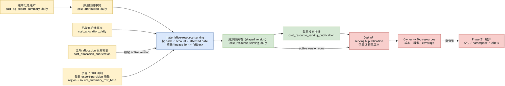

# Resource Serving Materialization Design

Status: Proposed
Date: 2026-08-26
Owners: Cost Insight (write path), CI Dashboard (read path)

## Decision

Replace the Cost Dashboard resource drilldown's request-time join between
`cost_attribution_daily` / `cost_allocation_daily` and
`cost_unmatched_resource_daily` with a daily, published serving projection.

The first release adds:

1. `cost_resource_serving_daily`: one daily owner/resource/service aggregate;
2. `cost_resource_serving_publication`: the active, validated materialization
   version for each source/account/date/basis window;
3. `materialize-resource-serving`: a resumable Cost Insight job.

A SKU/detail child projection is deliberately a second release. It is required
for expandable rows, but is not required to remove the `(no owner)` 504.

This is an application-maintained materialized table, not a TiDB automatic
materialized view. The source ledgers remain authoritative and auditable.

## Problem

`GET /api/v1/pages/cost-unmatched-resources` currently constructs a large CTE
in `ci-dashboard/src/ci_dashboard/api/queries/cost.py` and, for every request:

1. selects the requested Owner's native or allocated attribution facts;
2. resolves direct and grouped Kubernetes allocation lineage;
3. joins them to resource/SKU facts with nullable dimensions and a JSON tag
   comparison;
4. distributes source cost to resource detail, adds an attribution fallback,
   then groups and sorts the result.

For the production `(no owner)` window measured in August, that means roughly
775k attribution rows and 1.16m resource rows. The CTE is executed separately
for source stats, service choices, and the final Top-10 query. TiDB cancels it
for exceeding the per-query memory quota, which surfaces as a gateway 504.

The raw row count is intentional: resource facts preserve day × resource × SKU
and allocation dimensions. It is not appropriate to remove those facts or
merge CPU, memory, storage, and network SKU costs in the raw ledger. The issue
is that a resource investigation view is calculated online from two
high-cardinality facts.

## Goals

1. Resource drilldown always uses a bounded serving query; `(no owner)` must
   not execute the legacy broad join.
2. Resource totals reconcile to the selected Owner and allocation basis.
3. A missing or stale resource-detail row is explicit, never silently omitted.
4. Native, Kubernetes-allocated, EQ-allocated, and Kubernetes+EQ-allocated
   perspectives remain semantically distinct.
5. Resource names, services, labels, and later SKU details remain inspectable.
6. A failed/restarted job never publishes partial daily data.

## Non-goals

- Replacing `cost_bq_export_summary_daily`, `cost_attribution_daily`, or
  `cost_allocation_daily`.
- Making resource detail real-time or using it for invoice reconciliation.
- Raising TiDB's per-query memory limit as the primary fix.
- Collapsing raw resource/SKU facts into one source of truth.
- Building the expandable SKU UI in the first rollout.

## Terms and identity

| Term | Definition |
| --- | --- |
| **basis** | Serving `basis_key`: `native`, `kubernetes_allocated`, `eq_allocated`, or `kubernetes_eq_allocated`. The API maps `allocation_basis` as `current_attribution` → `native`, `residual_allocated` → `kubernetes_allocated`, `eq_allocated` → `eq_allocated`, and `residual_eq_allocated` → `kubernetes_eq_allocated`. |
| **source fact** | One attribution fact from `cost_attribution_daily`, or one active materialized allocation fact from `cost_allocation_daily`. |
| **resource detail** | A concrete row from `cost_unmatched_resource_daily`, normally a cloud resource and SKU charge. |
| **fallback** | A synthetic resource row representing source cost for which no exact resource-detail lineage is available. It preserves cost conservation and is visibly marked. |
| **resource group** | A stable cloud resource identity shown as one Top-resource row. A resource group may have multiple services and SKUs. |
| **resource key** | SHA-256 identity, stored as `CHAR(64)`, never a long display name used as a primary-key component. |
| **resource identity kind** | The deterministic origin of a serving row: `resource_detail` for a concrete resource/SKU identity, or `attribution_fallback` for one synthetic exact-source-fact identity. A row never uses `mixed`; that is an API aggregate status. |

`owner=''` remains the stored representation of `(no owner)`. `owner_key` is a
new serving-table convention: the materializer calculates
`SHA256(COALESCE(source.owner, ''))` and stores that same normalized value in
`owner`. This explicitly converts the `NULL` owner written by EQ chargeback
rows to `''`, so `(no owner)` has indexed identity `SHA256('')`. The API maps
the display label to that value. This is not a reuse of the JSON-based summary
identity helper; that helper remains the contract for `source_summary_row_hash`.

## Data flow

```text
billing summary ──> attribution / active allocation perspective ──┐
                                                                    ├─> resource-serving materializer
resource-detail import ──> exact source-summary lineage ──────────┘          │
                                                                               ├─> staged daily version
                                                                               └─> publication pointer
                                                                                       │
                                                             Dashboard Top resources / service filters
```



The editable diagram is `cost-resource-serving-materialization.drawio`.

## Source-lineage contract

The materializer must not make the current nullable/JSON resource join a
permanent background implementation. It needs an equality lineage path.

### Resource-detail lineage

Migration `018_add_resource_serving_materialization.sql` extends
`cost_unmatched_resource_daily` as part of the serving-table rollout:

```sql
ALTER TABLE cost_unmatched_resource_daily
  ADD COLUMN region VARCHAR(128) NULL AFTER usage_date,
  ADD COLUMN source_summary_row_hash CHAR(64) NULL AFTER source_row_hash,
  MODIFY COLUMN list_cost DECIMAL(16,9) NULL,
  MODIFY COLUMN effective_cost DECIMAL(16,9) NULL,
  MODIFY COLUMN credit_amount DECIMAL(16,9) NULL,
  MODIFY COLUMN net_cost DECIMAL(16,9) NULL,
  ADD KEY idx_cost_unmatched_resource_summary_lineage (
    vendor, account_id, usage_date, source_summary_row_hash
  );
```

`source_summary_row_hash` identifies the summary fact from which a concrete
resource-detail row was formed. A resource source row maps to exactly one
summary identity; several resource source rows may map to that identity and are
proportionally combined. `source_row_hash` remains the resource-detail row's
idempotency identity. The nullable lineage column permits legacy rows during
migration; the bounded date-replacement reimport leaves no legacy rows in a
published serving window.

The resource importer must calculate this hash before TiDB write with the same
canonical helper and complete identity used by the billing-summary importer:

- GCP billing-summary import calls the existing
  `build_gcp_summary_row_hash()`; AWS billing-summary import already reaches
  it through shared `_normalize_summary_row`. The GCP, AWS, and AWS split
  resource importers call that same helper directly. Despite its historical
  name, it includes `vendor` and is canonical for both; do not add an
  AWS-specific helper or perform a TiDB lookup to infer a hash.
- Each BigQuery resource projection emits a separate summary-identity payload
  containing every field in `GCP_SUMMARY_HASH_FIELDS` or
  `GCP_SPLIT_SUMMARY_HASH_FIELDS`, and groups by every one of those fields
  **and** the concrete resource identity (including parent resource where
  applicable). It must not use `ANY_VALUE` or omit a summary identity field
  while aggregating a resource row. The importer hashes that payload with
  `build_gcp_summary_row_hash()` and writes the result as
  `source_summary_row_hash`.
- The resource queries retain the concrete `resource_name` independently from
  the summary-identity resource name. For GKE direct facts, the latter is the
  workload name chosen by the summary ledger while the former remains the
  underlying cloud resource displayed to users. `region` is selected, grouped,
  persisted, and included in both identities.
- Monetary resource-query aggregates use `ROUND(..., 9)` (or an equivalently
  exact BigQuery `NUMERIC` expression), never `ROUND(..., 2)`, for list,
  effective, credit, and net cost. This applies to GCP, AWS, and AWS split
  resource projections; `usage_seconds` remains two-decimal duration data.

A lineage-aware resource row must also receive a new idempotency identity. The
concrete field-list delta is to append `region` and `source_summary_row_hash` to
`HASH_FIELDS`; `SPLIT_HASH_FIELDS` derives from that list, so the change applies
to both ordinary and split rows. The lineage hash encapsulates the remaining
summary-only split dimensions, such as schema version, cluster fields, and
Kubernetes cost classification. Thus a reimport cannot upsert a legacy resource
row in place when its summary lineage or region changes. The rollout reimports a
bounded full usage window by date replacement rather than mixing legacy and
lineage-aware resource rows. The migration index above supports the exact
`(vendor, account_id, usage_date, source_summary_row_hash)` join.

### Allocated perspectives

For rows with a nonempty `source_summary_row_hash`, the materializer joins the
selected source fact to resource detail by:

```text
vendor + account_id + usage_date + source_summary_row_hash
```

For grouped Kubernetes allocation rows with no direct summary hash, it expands
through the existing `cost_kubernetes_workload_allocation_source_daily`
allocation-group mapping, then performs the same equality join. The mapped
source-list-cost ratio is the allocation ratio used by the serving row.

There is no wildcard resource-name match and no JSON equality predicate in the
serving materializer's join.

### Fallback contract

A selected source fact with no matching resource details becomes a synthetic
fallback resource rather than disappearing:

- display name: its source resource name when available, otherwise
  `(resource detail unavailable)`;
- `fallback_list_cost` records the list-cost amount and `detail_list_cost` is
  zero;
- the row's total list, effective, credit, and net columns retain every
  available source amount; only list cost has separate detail/fallback
  components;
- `resource_data_source` in the API is `attribution_fallback` or `mixed`.

Thus every source amount remains visible even before a daily resource-detail
import has caught up. The API also returns resource-detail coverage, so a
fallback is never presented as a concrete cloud resource.

## Serving schema

### `cost_resource_serving_daily`

This is a versioned write table. The primary key is a surrogate to keep TiDB
clustered keys compact; the logical unique key contains compact hashes, not
long `owner` or `resource_name` strings.

```sql
CREATE TABLE cost_resource_serving_daily (
  id BIGINT NOT NULL AUTO_INCREMENT,
  materialization_version VARCHAR(64) NOT NULL,
  basis_key VARCHAR(32) NOT NULL,
  usage_date DATE NOT NULL,
  vendor VARCHAR(32) NOT NULL,
  account_id VARCHAR(128) NOT NULL,

  owner_key CHAR(64) NOT NULL,
  owner VARCHAR(255) NOT NULL DEFAULT '',
  group_id BIGINT NULL,
  manager_id BIGINT NULL,

  resource_group_key CHAR(64) NOT NULL,
  resource_key CHAR(64) NOT NULL,
  resource_name VARCHAR(512) NOT NULL,
  service_name VARCHAR(255) NULL,
  resource_identity_kind VARCHAR(32) NOT NULL,

  representative_labels_json JSON NULL,
  metadata_variant_count BIGINT NOT NULL DEFAULT 0,
  detail_list_cost DECIMAL(16,9) NOT NULL DEFAULT 0,
  fallback_list_cost DECIMAL(16,9) NOT NULL DEFAULT 0,
  usage_seconds DECIMAL(20,2) NULL,
  list_cost DECIMAL(16,9) NOT NULL,
  effective_cost DECIMAL(16,9) NULL,
  credit_amount DECIMAL(16,9) NULL,
  net_cost DECIMAL(16,9) NULL,
  source_row_count BIGINT NOT NULL DEFAULT 0,
  calculated_at DATETIME NOT NULL DEFAULT CURRENT_TIMESTAMP,

  PRIMARY KEY (id),
  UNIQUE KEY uk_resource_serving_versioned (
    materialization_version, basis_key, vendor, account_id, usage_date,
    owner_key, resource_key
  ),
  KEY idx_resource_serving_owner_date (
    basis_key, vendor, account_id, owner_key, usage_date
  ),
  KEY idx_resource_serving_group_date (
    basis_key, vendor, account_id, group_id, usage_date
  )
) ENGINE=InnoDB DEFAULT CHARSET=utf8mb4 COLLATE=utf8mb4_unicode_ci;
```

`resource_key` represents one stable resource-and-service identity.
`resource_group_key` excludes the service dimension, allowing the API to show
one resource with a service summary and later expand it. For
`resource_identity_kind='resource_detail'`, the canonical identity includes
vendor, account, normalized concrete resource name, parent resource where
applicable, and service. For `resource_identity_kind='attribution_fallback'`,
`resource_key` and `resource_group_key` are based on the exact source-fact
identity, so unrelated fallback costs cannot be mistaken for one resource.
The materializer writes only those two allowed values; `mixed` is produced only
when the API aggregates list-cost components across serving rows.

The parent table intentionally does **not** store one `sku_name`, `namespace`,
`repo`, `author`, or arbitrary label set. Those fields can vary within a
resource/day. `representative_labels_json` is selected deterministically from
the largest-cost contributing source row (then source hash for ties), and
`metadata_variant_count` tells the client that more than one label set exists.
It is display context only; it is never used for matching or filtering.

The serving and resource-detail monetary columns use `DECIMAL(16,9)`, matching
the current summary and allocation precision. Resource imports retain
nine-decimal aggregates before writing TiDB; rounding to cents occurs only at
Dashboard presentation.

### `cost_resource_serving_publication`

```sql
CREATE TABLE cost_resource_serving_publication (
  basis_key VARCHAR(32) NOT NULL,
  vendor VARCHAR(32) NOT NULL,
  account_id VARCHAR(128) NOT NULL,
  usage_date DATE NOT NULL,
  active_materialization_version VARCHAR(64) NOT NULL,
  source_allocation_version VARCHAR(64) NULL,
  detail_list_cost DECIMAL(16,9) NOT NULL DEFAULT 0,
  total_list_cost DECIMAL(16,9) NOT NULL DEFAULT 0,
  source_row_count BIGINT NOT NULL DEFAULT 0,
  published_at DATETIME NOT NULL DEFAULT CURRENT_TIMESTAMP,
  tiflash_ready_at DATETIME NULL,
  PRIMARY KEY (basis_key, vendor, account_id, usage_date)
) ENGINE=InnoDB DEFAULT CHARSET=utf8mb4 COLLATE=utf8mb4_unicode_ci;
```

A publication row is also the explicit zero/coverage marker for a valid daily
source window with no output rows. It is only written after validation. The API
joins it to serving rows rather than inferring an active version with `MAX()`.
`tiflash_ready_at` is optional performance metadata; it has no effect on TiKV
serving validity.

`cost_allocation_publication` is one global `publication_name='dashboard'`
pointer, not a per-date pointer. Each allocation publication rebuilds the
complete configured history and atomically changes the active allocation version
for every derived basis, vendor, account, and date. Native publication rows have
`source_allocation_version=NULL`. A derived publication row is valid only when
its `source_allocation_version` equals that one current global version.

The resource-serving pointer is intentionally finer grained. After a global
allocation flip, all older derived resource-serving publication rows fail this
version check at once. A resource-serving rebuild then replaces them one daily
window at a time with rows for the new version, so one global allocation version
can deliberately have partial current resource-serving coverage. Those windows
must never be aggregated with missing or stale dates.

### Future child table

Phase 2 adds `cost_resource_serving_sku_daily`. Its logical key is:

```text
materialization version + basis + vendor + account + date + owner key
+ resource key + SKU key + detail metadata hash
```

It preserves exact SKU, namespace, org/repo/branch/author, source allocation
scope, vendor tags, attribution metadata, and all cost amounts. The extra
metadata hash prevents distinct label/namespace rows from being silently
merged. Its index begins with the parent lookup dimensions and `resource_key`,
so expanding one resource is a narrow TiKV query.

## Materialization job

Add a `materialize-resource-serving` CLI command under `cost-insight`.

```text
materialize-resource-serving
  --start-date YYYY-MM-DD
  --end-date YYYY-MM-DD
  [--basis native|kubernetes_allocated|eq_allocated|kubernetes_eq_allocated]
  [--processing-start-date ... --processing-end-date ...]
  [--materialization-version ...]
  [--dry-run]
```

With no `--basis`, it builds native plus every currently published allocation
basis. For derived bases, a run captures the single active dashboard allocation
version once and uses that exact version for all of its windows. It processes one
`(basis, vendor, account_id, usage_date)` window at a time. If a measured day
still needs further partitioning, it shards by a stable source/resource hash; it
does **not** use `owner=''` as its only large batch.

For each window:

1. Resolve the selected source perspective. Native reads
   `cost_attribution_daily`; derived bases filter `cost_allocation_daily` by
   the allocation version captured from the global dashboard pointer.
2. Resolve direct and grouped source lineage as described above.
3. Use the source list-cost share to distribute every available source amount
   across its exact resource details. If that denominator is zero or details do
   not resolve, retain every available source amount on one fallback row.
4. Aggregate by owner, resource key, and service; calculate the deterministic
   representative metadata and detail/fallback amounts.
5. Write only a new `materialization_version` in bounded batches.
6. Verify the window's conservation contracts.
7. In one short transaction, re-read the global allocation pointer for a
   derived window and upsert its publication pointer only if it still matches
   the captured source allocation version. The upsert resets
   `tiflash_ready_at` to `NULL`.

A failed job can leave unreferenced staged rows, but cannot change the active
pointer. Retention cleanup removes unreferenced versions after the operational
rollback window.

### Invalidation and scheduling

The serving job runs after both attribution and resource-detail inputs for its
window are stable:

```text
billing summary refresh
→ attribution refresh / global allocation publication
→ resource-detail import
→ resource-serving materialization
```

A roster-triggered allocation rebuild is a coordinated availability event:

1. allocation materialization stages and validates the complete configured
   history, then flips the one global allocation pointer;
2. immediately after that flip, resource serving rebuilds every derived basis
   for the same complete history in non-overlapping daily windows;
3. each completed window becomes queryable only when its publication row carries
   the new global allocation version.

Consequently, a global allocation flip makes **all** prior derived
resource-serving windows pending across every date/account, not just the date
being processed. Native windows are unaffected and remain queryable. During the
full derived rebuild, partial current-version coverage is expected: the API
reports every requested invalid date as pending and returns no partial Top-10 or
service-filter result. Operators must schedule the allocation publication and
follow-on serving job together; the safe degraded state is an HTTP 200 pending
panel, never old chargeback data or the legacy join.

When attribution refresh replaces a date, it invalidates that date's native
resource-serving publication and removes the global allocation publication,
so derived views cannot serve a version built from stale native facts. A complete
allocation rebuild must pass conservation checks before it republishes the global
pointer. When resource detail is reimported, it invalidates the affected daily
serving publication and reruns materialization.

### Daily incremental resource import

The resource-detail path runs **once daily**, after the daily summary and
attribution refresh. It is export-partition incremental, not a daily re-scan of
the full resource window:

1. At cutover, import the latest 31 usage days plus the configured five-day
   export lag by usage-date replacement. This is the one-time lineage-aware
   baseline.
2. On every later run, read `cost_job_state` to select only export partitions
   newer than the resource-import watermark and no later than the stable
   `today - lag` partition. Keep only rows whose `usage_date` is inside the
   Dashboard's rolling 31-day window.
3. Upsert those partition-scoped resource facts, collect their distinct
   affected usage dates, and materialize only those daily serving windows.
4. Advance the export-partition watermark only after the resource facts have
   been written. A materialization failure leaves its publication invalidated
   and is safely retried for the affected dates; it never restores the legacy
   online query.

The source-row hash includes export partition, so late billing rows and
corrections arriving in a newer partition are additive inputs exactly like the
summary pipeline. Corrections older than the 31-day detail retention window
remain visible through attribution fallback rather than triggering an expensive
historical resource scan.

On 2026-08-26, BigQuery dry-runs against the production GCP billing export
measured 90.13 GB for the one-time 31-day baseline plus lag, but only 3.71 GB
for one new export partition with the same 31-day usage filter. At one daily
partition, the expected steady-state scan is about 26 GB/week; these are
planning estimates, not a billing guarantee. A sub-daily schedule is not useful
because the export is day-partitioned and has a five-day stability lag.

The production CronJob is configured with `concurrencyPolicy: Forbid`. It is
resumable by non-overlapping partition/date windows; a rerun replaces only its
own staged daily version.

## Conservation and correctness contracts

For every published `(basis, vendor, account, usage_date, owner)` window, the
sum of serving `list_cost`, `effective_cost`, `credit_amount`, and `net_cost`
each equals the corresponding sum of selected source-fact amounts to one
nanodollar unit.

`detail_list_cost` and `fallback_list_cost` are deliberately **list-cost-only**
components; the table does not persist analogous effective, credit, or net
components. Therefore only list cost has the additional component identity:

```text
sum(detail_list_cost) + sum(fallback_list_cost) = sum(list_cost)
```

Additional contracts:

1. Each source fact contributes once to either one-or-more proportionally split
   details plus a residual fallback, or fallback alone. The materializer applies
   the same list-cost share to every available total amount before aggregation.
2. `detail_list_cost + fallback_list_cost = list_cost` on every serving row and
   after aggregation. Effective, credit, and net cost are verified by their
   total-column conservation above, not nonexistent detail/fallback components.
3. A `resource_data_source` shown by the API is derived from the two list-cost
   components: `resource_detail`, `attribution_fallback`, or `mixed`; it is not
   an arbitrary last-row value.
4. A derived-basis row cannot be served after its allocation version loses the
   global publication pointer.
5. Re-running the same input/version is idempotent.
6. A resource metadata variation never changes amount identity; it increments
   metadata variation and remains fully available in the future child table.

## Dashboard API and UI

Keep the existing route and request parameters for a surgical first rollout:

```text
GET /api/v1/pages/cost-unmatched-resources
```

The endpoint retains `owner`, `service_name`, `sort_by`, `allocation_basis`,
and the existing optional `cost_vendor`/`cost_account_id` filters. It maps the
requested basis to the serving `basis_key` as defined above and reads only
published serving rows. Source filters are not made single-account-only: the
same `scoped_sources` CTE is used by Top-resource, service-choice, coverage,
and publication-validity queries. It selects active `cost_sources` matching any
provided vendor and/or account filter; with neither filter it selects every
active source. For each requested date, a source is expected only when
`source_available_from` is NULL or not after that date. Missing publication for
any expected source/date makes that date pending, while an explicit zero marker
makes it valid.

```sql
WITH scoped_sources AS (
  SELECT vendor, account_id
  FROM cost_sources
  WHERE is_active = 1
    AND (:cost_vendor IS NULL OR vendor = :cost_vendor)
    AND (:cost_account_id IS NULL OR account_id = :cost_account_id)
)
SELECT
  s.resource_group_key,
  MIN(s.resource_name) AS resource_name,
  SUM(s.list_cost) AS list_cost,
  SUM(s.usage_seconds) AS usage_seconds,
  SUM(s.detail_list_cost) AS detail_list_cost,
  SUM(s.fallback_list_cost) AS fallback_list_cost
FROM cost_resource_serving_daily s
JOIN scoped_sources scope
  ON scope.vendor = s.vendor
 AND scope.account_id = s.account_id
JOIN cost_resource_serving_publication p
  ON p.basis_key = s.basis_key
 AND p.vendor = s.vendor
 AND p.account_id = s.account_id
 AND p.usage_date = s.usage_date
 AND p.active_materialization_version = s.materialization_version
LEFT JOIN cost_allocation_publication ap
  ON ap.publication_name = 'dashboard'
WHERE s.basis_key = :basis_key
  AND s.owner_key = :owner_key
  AND s.usage_date BETWEEN :start_date AND :end_date
  AND (
    s.basis_key = 'native'
    OR p.source_allocation_version = ap.active_allocation_version
  )
  AND (:service_name IS NULL OR s.service_name = :service_name)
GROUP BY s.resource_group_key
ORDER BY SUM(s.list_cost) DESC, resource_name
LIMIT 10;
```

The implementation may use equivalent deterministic display expressions, but
must not read `cost_unmatched_resource_daily` or run allocation CTE arithmetic
on this request path.

Response metadata adds:

```json
{
  "resource_data_source": "resource_detail|attribution_fallback|mixed",
  "resource_detail_cost": 123.45,
  "resource_detail_coverage_pct": 87.2,
  "materialized": true,
  "pending_dates": []
}
```

Before issuing Top-resource, service-choice, or source-coverage queries, the
endpoint evaluates every expected `(vendor, account, date)` from
`scoped_sources` against its publication row. A source/date is valid only when
it has a published row for the requested basis and it is either an explicit zero
marker or resolves serving rows at that row's active materialization version.
For a derived basis, its `source_allocation_version` must also match the global
allocation pointer. Every serving query uses that same validity predicate.

If any date is invalid, return HTTP 200 with no misleading partial Top-10,
service-filter, or coverage result and populate `pending_dates` with all invalid
dates. This includes the expected partial coverage during a post-allocation
full-history rebuild. The UI renders “Resource details are being materialized”
and retries on the next normal refresh. It never falls back to the legacy broad
query, especially for `(no owner)`.

Phase 1 keeps the table flat but displays the concrete resource name, service
summary, detail/fallback source, coverage, representative labels, and observed
dates. Phase 2 adds an expand control that calls a narrow SKU-detail endpoint.

## TiFlash strategy

TiFlash is optional performance capacity, not a correctness mechanism.

- Start with TiKV and `idx_resource_serving_owner_date`; it is ideal for one
  Owner, one account, a short date range, and child-row expansion.
- After correctness and capacity validation, add one TiFlash replica to
  `cost_resource_serving_daily`. It can accelerate `(no owner)` and broad
  31-day Top-resource aggregation, which still scans and groups many daily
  resource rows.
- Do not add TiFlash to raw resource facts merely to keep the old nullable/JSON
  join alive.
- The child SKU table should initially remain TiKV-indexed because an expansion
  filters a single resource key.

Phase 1 always uses TiKV. A later resource-serving read helper may issue
`READ_FROM_STORAGE(TIFLASH[s])` only when all of these gates pass:

1. the single `(vendor, account_id)` request is in the Dashboard's configured
   `TIFLASH_COST_SOURCES` allowlist;
2. `INFORMATION_SCHEMA.TIFLASH_REPLICA` reports the serving-table replica
   available and fully synchronized; and
3. every already-valid requested publication row has `tiflash_ready_at` set for
   its active materialization version.

After publishing a daily version, a post-publication worker probes that exact
version through TiFlash and verifies its count and amounts against the
publication row before setting `tiflash_ready_at`, conditional on the version
still being active. If any gate fails, the entire request uses the indexed TiKV
plan; it never combines TiFlash dates with TiKV dates. A publication row proves
source completeness but does not by itself prove replica freshness.

## Rollout

1. **Schema and lineage shadow**
   - add the serving/publication tables plus resource `region`,
     `source_summary_row_hash`, lineage lookup index, and nine-decimal monetary
     columns;
   - update GCP, AWS, and AWS split resource importers to group and retain the
     complete canonical summary identity, calculate canonical lineage, and
     remove cents rounding from monetary aggregates;
   - reimport a bounded 31-day resource window by replacement, then verify the
     daily export-partition watermark path on one stable partition;
   - do not change the Dashboard read path yet.
2. **Materialization shadow**
   - materialize the same dates and all available bases;
   - compare current endpoint results for representative matched Owner,
     `(no owner)`, GKE workload, AWS split, and fallback cases;
   - require amount conservation to nine decimals and compare Top-resource
     ordering after expected metadata grouping differences are explained.
3. **Serving cutover**
   - deploy the Dashboard read path and flat-table source/coverage metadata;
   - do not provide the old broad-query fallback;
   - monitor endpoint p95/error rate, publication age, fallback share, and
     TiDB memory cancellation count.
4. **TiFlash decision**
   - capture TiKV `EXPLAIN ANALYZE` at production cardinality;
   - add a replica and compare plan/latency only if the `(no owner)` aggregate
     needs it.
5. **Expandable details**
   - add child materialization, endpoint, and UI expansion after the parent
     serving path is stable for at least one normal resource-import cycle.

Rollback of the serving reader is not permission to restore the legacy
unbounded `(no owner)` query. If the serving publication is unavailable, the
safe degraded behavior is an explicit pending panel.

## Tests and acceptance criteria

### Cost Insight unit/integration tests

- canonical shared GCP/AWS resource-to-summary lineage hashes, including GKE
  direct workload identity, all split identity dimensions, and region; assert
  that resource `source_row_hash` changes for `region` and
  `source_summary_row_hash` and that no resource query rounds a monetary amount
  to cents;
- direct exact lineage, grouped Kubernetes lineage, and no-match fallback;
- native and all three allocated bases select the correct active perspective;
- zero/negative list-cost detail handling and all four amount conservation;
- no-owner identity (including `NULL` EQ owners normalized to `''`), service
  filtering, resource/group key determinism, and label variation handling;
- idempotent reruns, failed staged writes, publication atomicity, and a global
  allocation-version flip that invalidates all derived dates until each is
  rebuilt under the current version;
- a 31-day resource reimport replaces legacy resource rows rather than mixing
  legacy and lineage-aware identities;
- a daily new export partition updates only its affected usage dates and does
  not rescan the 31-day resource window.

### Dashboard tests

- existing route and response compatibility for owner click-through;
- no-owner reads only serving/publication tables and never executes the legacy
  CTE path;
- service choices and sorting preserve current behavior;
- a global allocation flip reports all requested derived pending dates and
  produces an actionable panel state, not a partial result or 504/error;
- TiFlash hints are issued only for replica-ready publication versions and
  otherwise retain the TiKV plan;
- detail coverage and fallback metadata are correct;
- Phase 2: one expanded resource fetches only its child rows.

### Production acceptance

1. The no-owner request has no query-memory cancellation or 504.
2. `EXPLAIN ANALYZE` shows no raw-resource/attribution nullable join in the
   serving endpoint.
3. Published source totals and resource-serving totals reconcile to one
   nanodollar unit for every available amount.
4. A resource window either has complete serving publication or explicitly
   reports pending; it never silently returns a partial result.
5. The normal 31-day `(no owner)` request meets the agreed latency SLO before
   and after optional TiFlash enablement.
6. The Top-resource panel clearly distinguishes concrete detail from fallback
   cost and can lead users to resource names/labels when detail exists.

## Files expected during implementation

### Cost Insight

- `sql/018_add_resource_serving_materialization.sql`: create the serving and
  publication tables; add `region` and `source_summary_row_hash`, the exact
  lineage lookup index, and `DECIMAL(16,9)` list/effective/credit/net columns
  to `cost_unmatched_resource_daily`.
- `src/cost_insight/common/gcp_summary_identity.py` (reuse the existing shared
  GCP/AWS summary identity; no AWS-specific helper)
- `src/cost_insight/sources/gcp_billing_export.py`
- `src/cost_insight/sources/aws_billing_export.py`
- `src/cost_insight/sources/aws_split_cost_export.py`
- `src/cost_insight/jobs/sync_gcp_unmatched_resources.py`
- `src/cost_insight/jobs/sync_aws_unmatched_resources.py`
- `src/cost_insight/jobs/materialize_resource_serving.py`
- `src/cost_insight/jobs/refresh_attribution_daily.py`
- `src/cost_insight/jobs/materialize_cost_allocations.py`
- `src/cost_insight/jobs/cli.py`
- associated tests and README/job-runbook documentation

### CI Dashboard

- `src/ci_dashboard/api/queries/cost.py`
- `tests/api/test_routes.py` and resource-serving query tests
- `web/src/components/charts.jsx`
- `web/src/pages/CostPage.jsx`
- frontend tests for loading, pending, source coverage, and later expansion
