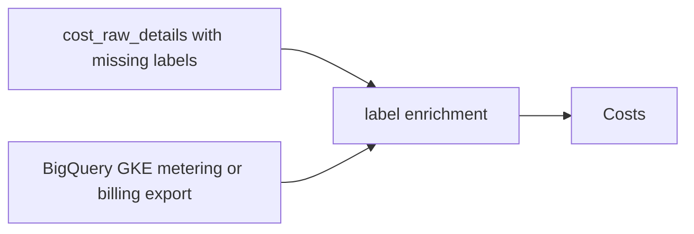
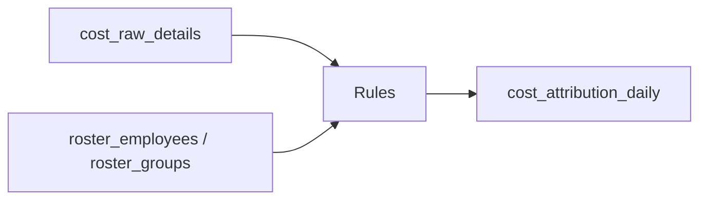
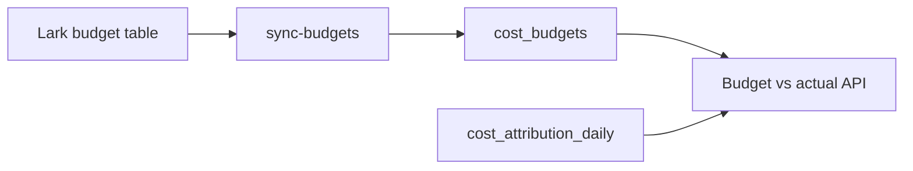

# Cost Data System Design

## Goals

Build a small, vendor-neutral cost data system that can:

- collect cost and usage details from cloud billing sources
- preserve enough line-item detail for arbitrary aggregation
- attribute CI usage and cost by `author`, `repo`, roster group, and manager
- compare attributed spend with period budgets later
- support GCP first, then AWS and other vendors without table renames

Non-goals for the first version:

- real-time cost enforcement
- complex budget workflow or Lark sync
- full historical roster snapshots
- a generic FinOps warehouse with every cloud-specific field promoted to columns

## Project Layout

The cost system should live in a new top-level project folder:

```text
cost-insight/
  docs/
  sql/
  src/cost_insight/
  tests/
```

This keeps cost independent from `ci-dashboard`. The two systems can share the
same TiDB instance and can join roster tables, but cost owns its own schema,
jobs, and API surface.

## Source Direction

Use BigQuery billing exports as the primary cost source.

For GCP, the preferred source is Cloud Billing Detailed usage export:

```text
gcp-digital-bi.gcp_billing_detailed.gcp_billing_export_resource_v1_01D088_8F9CF2_8AF1C6
```

This source has resource-level fields, usage fields, labels, credits, list-cost
fields, price fields, and export timestamps. It is a better primary source than
Billing APIs because the system needs arbitrary aggregation and invoice-like
line items.

Current known facts for the first GCP source:

| Field | Value |
| --- | --- |
| GCP project to import | `pingcap-testing-account` |
| Earliest useful history | `2026-01-01` |
| Approximate source volume | about 330K billing export rows per day |
| Currency | `USD` |
| Last validated local access | available through `bq` from this workspace |

The ETL should aggregate this source before writing to TiDB. We do not need to
store every hourly export row locally.

Use APIs only as auxiliary sources:

- Billing Account API: account and project metadata
- Budget API or Lark: budget metadata later

For the current GCP project, we also have GKE metering tables:

```text
pingcap-testing-account.pingcap_ee_data.gke_cluster_resource_usage
pingcap-testing-account.pingcap_ee_data.gke_cluster_resource_consumption
```

These are useful for CI attribution because they expose Kubernetes labels such
as `author`, `repo`, pod/resource names, CPU seconds, and memory byte-seconds.
They are usage sources, not invoice/cost sources.

Known useful labels in current GCP billing and usage exports:

| Source label | Normalized column | Usage |
| --- | --- | --- |
| `k8s-label/author` or `author` | `author` | CI person attribution |
| `k8s-label/org` or `org` | `org` | GitHub organization grouping |
| `k8s-label/repo` or `repo` | `repo` | repo-level budget and cost views |
| `k8s-namespace` or row namespace | `namespace` | CI vs system/platform grouping |
| Pod/resource name from source export | `resource_name` | Resource investigation when labels are missing |

Validation snapshot from the last 30 days:

| Check | Result |
| --- | --- |
| billing export rows for `pingcap-testing-account` | about 29.8M rows |
| rows with `author/repo/org` | about 18.2% |
| net cost with `author/repo/org` | about 26.6% |
| rows with namespace | about 92.0% |
| rows with resource or workload name | about 99.8% |
| net cost with resource or workload name | about 98.4% |

This means label enrichment is important, but the raw billing export already
has enough resource/workload naming to investigate most unallocated cost.

## Cost Terms

The system should expose four related amounts:

| Term | Meaning |
| --- | --- |
| `list_cost` | Cost at public/list price before negotiated discount |
| `effective_cost` | Cost after negotiated or contract discount, before credits |
| `credit_amount` | Credits, promotions, CUD/SUD credits, or adjustments; usually negative |
| `net_cost` | Actual charged/allocated cost after credits: `effective_cost + credit_amount` |

For GCP billing export:

| System field | GCP source field |
| --- | --- |
| `list_cost` | `cost_at_list` or `cost_at_list_consumption_model` |
| `effective_cost` | `cost` or `cost_at_effective_price_default` |
| `credit_amount` | `SUM(credits.amount)` |
| `net_cost` | `cost + SUM(credits.amount)` |

When a source does not provide all fields, leave the missing amount as `NULL`
instead of inventing values.

## Tables

### `cost_sources`

Stores the smallest cloud billing or usage sources that cost collectors are
allowed to import. For GCP this is a project; for AWS this is an account.

```sql
CREATE TABLE cost_sources (
  id BIGINT NOT NULL AUTO_INCREMENT,
  vendor VARCHAR(32) NOT NULL,
  account_id VARCHAR(128) NOT NULL,
  billing_account_id VARCHAR(128) NULL,
  display_name VARCHAR(255) NULL,
  is_active TINYINT(1) NOT NULL DEFAULT 1,
  created_at DATETIME NOT NULL DEFAULT CURRENT_TIMESTAMP,
  updated_at DATETIME NOT NULL DEFAULT CURRENT_TIMESTAMP ON UPDATE CURRENT_TIMESTAMP,
  PRIMARY KEY (id),
  UNIQUE KEY uk_cost_sources_vendor_account (vendor, account_id),
  KEY idx_cost_sources_billing_account (billing_account_id)
);
```

Sample:

| vendor | account_id | billing_account_id | display_name |
| --- | --- | --- | --- |
| `gcp` | `pingcap-testing-account` | `01ABCD-234EFG-567HIJ` | `PingCAP Testing` |
| `aws` | `123456789012` | `123456789012` | `QE CI AWS` |

Notes:

- `account_id` means GCP project ID for GCP and AWS account ID for AWS.
- `billing_account_id` is nullable because some usage-only sources might not
  know the billing account.
- No `environment` column for now. The source itself is already the minimum
  collection unit, and sub-classification should come from labels, repo, group,
  or manager.
- No generic `metadata_json` for now. If a concrete source attribute becomes
  necessary, add a named column or a separate mapping table then.

### `cost_raw_details`

Daily cost fact table. Keep this intentionally small: enough to show cost by
day, source account, service, billing item, region, and the current CI
dimensions. Do not mirror the full cloud billing export schema in TiDB. When
deep invoice reconciliation is needed, query the original BigQuery billing
export directly.

```sql
CREATE TABLE cost_raw_details (
  id BIGINT NOT NULL AUTO_INCREMENT,
  vendor VARCHAR(32) NOT NULL,
  account_id VARCHAR(128) NOT NULL,
  billing_account_id VARCHAR(128) NULL,
  usage_date DATE NOT NULL,

  service_name VARCHAR(255) NULL,
  sku_name VARCHAR(255) NULL,
  region VARCHAR(128) NULL,
  namespace VARCHAR(255) NULL,
  author VARCHAR(255) NULL,
  org VARCHAR(255) NULL,
  repo VARCHAR(255) NULL,
  resource_name VARCHAR(512) NULL,

  usage_seconds DECIMAL(20, 2) NULL,

  list_cost DECIMAL(16, 2) NULL,
  effective_cost DECIMAL(16, 2) NULL,
  credit_amount DECIMAL(16, 2) NULL,
  net_cost DECIMAL(16, 2) NULL,

  source_export_time DATETIME NULL,
  source_row_hash CHAR(64) NOT NULL,
  created_at DATETIME NOT NULL DEFAULT CURRENT_TIMESTAMP,
  updated_at DATETIME NOT NULL DEFAULT CURRENT_TIMESTAMP ON UPDATE CURRENT_TIMESTAMP,

  PRIMARY KEY (id),
  UNIQUE KEY uk_cost_raw_details_source_row (vendor, account_id, source_row_hash),
  KEY idx_cost_raw_details_date_account (usage_date, vendor, account_id),
  KEY idx_cost_raw_details_service (usage_date, service_name),
  KEY idx_cost_raw_details_sku (usage_date, service_name, sku_name),
  KEY idx_cost_raw_details_author (usage_date, author),
  KEY idx_cost_raw_details_repo (usage_date, org, repo),
  KEY idx_cost_raw_details_resource_name (resource_name(255)),
  KEY idx_cost_raw_details_export_time (source_export_time)
);
```

Sample GCP billing row:

| field | value |
| --- | --- |
| `vendor` | `gcp` |
| `account_id` | `pingcap-testing-account` |
| `billing_account_id` | `01ABCD-234EFG-567HIJ` |
| `usage_date` | `2026-05-18` |
| `service_name` | `Compute Engine` |
| `sku_name` | `N1 Predefined Instance Core running in Americas` |
| `region` | `us-central1` |
| `namespace` | `prow-test-pods` |
| `author` | `hawkingrei` |
| `org` | `pingcap` |
| `repo` | `tidb` |
| `resource_name` | `cap-ticdc-pull-cdc-storage-integration-light-next-gen-318-qh26q` |
| `usage_seconds` | `45000.00` |
| `list_cost` | `0.85` |
| `effective_cost` | `0.68` |
| `credit_amount` | `-0.12` |
| `net_cost` | `0.56` |

Sample AWS CUR row later:

| field | value |
| --- | --- |
| `vendor` | `aws` |
| `account_id` | `123456789012` |
| `service_name` | `Amazon Elastic Compute Cloud` |
| `sku_name` | `EBS:VolumeUsage.gp3` |
| `usage_date` | `2026-05-18` |
| `author` | `hawkingrei` |
| `repo` | `tidb` |
| `resource_name` | `gke-prow-nap-e2-standard-32-l1evms3o-44832b66-bhbs` |
| `usage_seconds` | `86400.00` |
| `list_cost` | `2.40` |
| `effective_cost` | `1.92` |
| `credit_amount` | `0.00` |
| `net_cost` | `1.92` |

Notes:

- `invoice_month` is intentionally omitted. Monthly queries can use
  `usage_date`; invoice-specific reconciliation can stay in BigQuery export.
- `usage_start_time` and `usage_end_time` are intentionally omitted because the
  product view is daily. If hourly analysis becomes necessary, add an hourly
  summary table instead of widening this one.
- `sku_name` is stored because `service_name` is too coarse for "where did the
  money go" analysis. For example, GCP `Compute Engine` can include VM core,
  memory, disk, and network SKUs; AWS `EC2` can include instance, EBS, and data
  transfer style costs.
- `sku_id`, resource id, resource type, and zone are intentionally omitted for
  now. They are not needed for the initial product questions and make the table
  look more precise than our planned usage.
- `author`, `org`, `repo`, `namespace`, and `resource_name` are promoted because
  they are current product dimensions or investigation keys. Other labels stay
  in the source BigQuery export until a real query needs them.
- `usage_seconds` is the only promoted usage measure in this table. Convert
  pure time units such as `hour`, `minute`, and `second` to seconds in ETL. For
  compound or non-time units such as `gibibyte hour`, `gibibyte month`, `count`,
  or `gibibyte`, leave it `NULL` and use cost fields.
- Do not store raw source JSON. BigQuery remains the source of truth for
  source-specific fields and invoice-level debugging.
- `resource_name` should prefer `k8s-workload-name` when present because it is
  usually the CI pod/workload name. Fall back to `resource.name`, then
  `resource.global_name` for VM, disk, load balancer, storage, or other cloud
  resources.
- `source_row_hash` should be deterministic from stable dimension columns. For
  GCP, include billing account, project, date, service, SKU, region, normalized
  label columns, and resource name. Do not include cost amounts or export time;
  late corrections should update the same aggregate row instead of creating a
  duplicate.
- `source_row_hash` is for idempotent upsert. The collector can safely re-read a
  date range without creating duplicate rows.
- `source_export_time` is for incremental sync and late correction detection.
  Billing export data can arrive late or be corrected after the original usage
  date, so the job should read with overlap and advance this watermark only
  after a successful import.
- Amount columns are USD. Do not store a `currency` column until a non-USD
  source becomes real.
- Cost and budget amounts use `DECIMAL(16,2)`. We do not need more than cents
  for product reporting, and one project daily cost will not approach this
  range.

### `cost_attribution_daily`

Daily attributed summary by author, repo, roster group, and manager.

```sql
CREATE TABLE cost_attribution_daily (
  id BIGINT NOT NULL AUTO_INCREMENT,
  usage_date DATE NOT NULL,
  vendor VARCHAR(32) NOT NULL,
  account_id VARCHAR(128) NOT NULL,
  service_name VARCHAR(255) NULL,
  sku_name VARCHAR(255) NULL,

  org VARCHAR(255) NULL,
  repo VARCHAR(255) NULL,
  resource_name VARCHAR(512) NULL,
  author VARCHAR(255) NULL,
  owner VARCHAR(255) NULL,
  attribution_key VARCHAR(255) NULL,
  attribution_source VARCHAR(64) NOT NULL,
  attribution_status VARCHAR(64) NOT NULL,

  employee_id BIGINT NULL,
  group_id BIGINT NULL,
  manager_id BIGINT NULL,

  usage_seconds DECIMAL(20, 2) NULL,
  list_cost DECIMAL(16, 2) NULL,
  effective_cost DECIMAL(16, 2) NULL,
  credit_amount DECIMAL(16, 2) NULL,
  net_cost DECIMAL(16, 2) NULL,
  source_rows BIGINT NOT NULL DEFAULT 0,
  dimension_hash CHAR(64) NOT NULL,
  updated_at DATETIME NOT NULL DEFAULT CURRENT_TIMESTAMP ON UPDATE CURRENT_TIMESTAMP,

  PRIMARY KEY (id),
  UNIQUE KEY uk_cost_attribution_daily_dimension_hash (usage_date, dimension_hash),
  KEY idx_cost_attribution_daily_author (usage_date, author),
  KEY idx_cost_attribution_daily_repo (usage_date, org, repo),
  KEY idx_cost_attribution_daily_group (usage_date, group_id),
  KEY idx_cost_attribution_daily_manager (usage_date, manager_id)
);
```

Sample:

| usage_date | account_id | service_name | sku_name | repo | author | resource_name | attribution_status | group_id | manager_id | usage_seconds | net_cost |
| --- | --- | --- | --- | --- | --- | --- | --- | --- | --- | --- | --- |
| `2026-05-18` | `pingcap-testing-account` | `Compute Engine` | `N1 Predefined Instance Core running in Americas` | `ticdc` | `liyishuai` | `cap-ticdc-pull-cdc-storage-integration-light-next-gen-318-qh26q` | `matched` | `42` | `7` | `65700.00` | `245.12` |
| `2026-05-18` | `pingcap-testing-account` | `Cloud Storage` | `Standard Storage US` | `NULL` | `NULL` | `NULL` | `unmatched` | `NULL` | `NULL` | `NULL` | `31.50` |

Attribution rules for V1:

1. CI usage uses `author` as the primary key.
2. `owner` is supported but lower priority because current CI labels mainly use
   `author`.
3. Match `author` to `roster_employees.github_id` first.
4. If the value looks like an email, match `roster_employees.email`.
5. Attach `group_id` and `manager_id` from the current active roster.
6. System namespaces such as `kube-system` and `flux-system` are marked
   `system` unless labels clearly identify an owner.
7. Unmatched rows stay visible with `attribution_status = 'unmatched'`.

### `cost_budgets`

Budget table for later Lark sync. Budgets are requested for a period, usually a
year, with explicit start and end dates. Monthly budget views and alerts should
derive a monthly allocation from this period budget instead of storing budgets
as if they were requested month by month.

```sql
CREATE TABLE cost_budgets (
  id BIGINT NOT NULL AUTO_INCREMENT,
  vendor VARCHAR(32) NOT NULL,
  account_id VARCHAR(128) NOT NULL,
  period_start_date DATE NOT NULL,
  period_end_date DATE NOT NULL,
  budget_name VARCHAR(255) NULL,
  label_filters JSON NULL,
  filter_hash CHAR(64) NOT NULL,
  group_id BIGINT NULL,
  manager_id BIGINT NULL,
  repo VARCHAR(255) NULL,
  budget_amount DECIMAL(16, 2) NOT NULL,
  source_type VARCHAR(64) NOT NULL DEFAULT 'manual',
  source_ref VARCHAR(512) NULL,
  created_at DATETIME NOT NULL DEFAULT CURRENT_TIMESTAMP,
  updated_at DATETIME NOT NULL DEFAULT CURRENT_TIMESTAMP ON UPDATE CURRENT_TIMESTAMP,
  PRIMARY KEY (id),
  UNIQUE KEY uk_cost_budgets_scope (
    vendor,
    account_id,
    period_start_date,
    period_end_date,
    filter_hash
  ),
  KEY idx_cost_budgets_period (period_start_date, period_end_date),
  KEY idx_cost_budgets_group (group_id),
  KEY idx_cost_budgets_manager (manager_id),
  KEY idx_cost_budgets_repo (repo)
);
```

Sample:

| period_start_date | period_end_date | vendor | account_id | budget_name | label_filters | repo | budget_amount |
| --- | --- | --- | --- | --- | --- | --- | --- |
| `2026-01-01` | `2026-12-31` | `gcp` | `pingcap-testing-account` | `TiCDC CI` | `{"repo":"ticdc","org":"pingcap"}` | `ticdc` | `60000.00` |
| `2026-01-01` | `2026-12-31` | `gcp` | `pingcap-testing-account` | `Other CI` | `{"repo":["tidb","pd","tikv"]}` | `NULL` | `144000.00` |

Notes:

- `label_filters = NULL` means the whole source account/project.
- JSON filter semantics are AND across keys. A scalar value means equality; an
  array means `IN`.
- `filter_hash` is SHA256 over canonicalized `label_filters`, with keys sorted
  and array values sorted. The helper lives in `cost_insight.budgets` so budget
  sync can reuse one deterministic implementation.
- `group_id`, `manager_id`, and `repo` are optional denormalized fields for fast
  filtering in common views. The authoritative matching condition is
  `label_filters`.

### `cost_job_state`

Tracks ETL watermarks and run status.

```sql
CREATE TABLE cost_job_state (
  job_name VARCHAR(128) NOT NULL,
  watermark_json JSON NOT NULL,
  last_started_at DATETIME NULL,
  last_succeeded_at DATETIME NULL,
  last_status VARCHAR(16) NOT NULL DEFAULT 'never',
  last_error TEXT NULL,
  updated_at DATETIME NOT NULL DEFAULT CURRENT_TIMESTAMP ON UPDATE CURRENT_TIMESTAMP,
  PRIMARY KEY (job_name)
);
```

Sample watermarks:

| job_name | watermark_json |
| --- | --- |
| `sync_gcp_billing_export:gcp:pingcap-testing-account` | `{"account_id":"pingcap-testing-account","start_date":"2026-05-15","end_date":"2026-05-18"}` |
| `refresh_cost_attribution_from_summary:aws:946646677266` | `{"vendor":"aws","account_id":"946646677266","start_date":"2026-05-01","end_date":"2026-05-31"}` |

## ETL Flow

### Flow 1: GCP Detailed Billing Export

Purpose: import daily cost facts from billing export.


Steps:

1. Discover active sources from `cost_sources` for the current vendor and
   ensure each source is active before import starts.
2. Read a usage-date range. On scheduled runs, re-read the last successful
   `end_date - overlap_days` window because billing export can receive late
   corrections.
3. Aggregate billing rows by day, project/account, service, SKU, region, author,
   org, repo, namespace, and resource name.
4. Normalize the aggregate into `cost_raw_details`.
5. Convert time-based usage to `usage_seconds`; leave non-time usage as `NULL`.
6. Upsert by `(vendor, account_id, source_row_hash)`.
7. Advance watermark only after all rows are committed.

Important behavior:

- Always use overlap because billing export can receive late corrections.
- Preserve adjustment rows. Do not drop tax, rounding, or correction rows unless
  a concrete product question needs a regular-usage-only view later.
- If a correction changes old cost, upsert the affected aggregate row and let
  the daily total move to the corrected value.

### Flow 2: Label Enrichment

Purpose: fill missing `author`, `org`, `repo`, `namespace`, and `resource_name`
dimensions when billing export rows do not have enough labels.



Steps:

1. Find recent `cost_raw_details` rows where attribution dimensions are missing.
2. Try to enrich from billing export labels first.
3. If billing export labels are insufficient, use GKE metering tables as an
   auxiliary lookup source.
4. If enrichment still fails, keep the row unallocated. Do not create another
   usage table just for missing-label cases.
5. For manual investigation, use source fields such as resource id or resource
   name in BigQuery or the cloud console. Do not store those fields in TiDB
   until product queries need them.

Useful current labels:

| label | Usage |
| --- | --- |
| `author` | primary CI author attribution |
| `repo` | repository aggregation |
| `org` | GitHub organization |
| `resource_name` | pod or VM name for manual investigation |
| `jenkins/label` | Jenkins pod label |
| `namespace` | system vs CI classification |

### Flow 3: Attribution Refresh

Purpose: map cost and usage to author, repo, group, and manager.



Rules:

1. Build a working set for affected dates.
2. Read normalized columns: `author`, `repo`, `org`, `resource_name`, and
   `namespace`.
3. Use `author` first for CI attribution.
4. Join `author` to `roster_employees.github_id`.
5. If GitHub ID does not match, try employee email and email local-part.
6. Attach `group_id` and `manager_id` from current roster tables. If an
   employee manager is missing, fall back to the roster group's manager.
7. Aggregate by day, vendor, account, service, SKU, org, repo, resource, author,
   group, and manager.
8. Write unmatched data instead of hiding it.
9. Refresh is rebuildable by date range: delete existing attributed rows for
   the same `vendor/account/date` range, then insert the newly aggregated
   result. This keeps late billing corrections and roster fixes simple.
10. Run larger refreshes with `--split-by-day` so each TiDB query stays within
    the single-query memory quota.

Current V1 attribution statuses:

| status | source | Meaning |
| --- | --- | --- |
| `matched` | `author_github` | `author` matched active roster GitHub ID |
| `matched` | `author_email` | `author` matched active roster email or email local-part |
| `unmatched` | `author_label` | `author` exists but no active roster employee matched |
| `unattributed` | `missing_author` | no author label exists |

Cost attribution with billing export:

- If billing export has useful labels, attribute directly from billing rows.
- If billing rows only identify cluster/node resources, allocate cluster-level
  cost to CI authors/repos using GKE usage share for the same day and resource
  type.
- Shared/system cost is not allocated in V1. Keep it visible as shared or
  unallocated, and decide allocation rules in the presentation layer later.
- Some shared cost is known to belong to the EQ team; other shared-looking cost
  is caused by incomplete labels. Prioritize label enrichment before inventing
  allocation rules.
- Start with CPU and memory allocation only if we later need explicit
  proportional allocation. Add storage/network later when source labels are
  clear enough.

Allocation example:

```text
day = 2026-05-18
sku = VM core
cluster net_cost = 100 USD
ticdc author usage = 72,000 seconds
cluster total attributed usage = 720,000 seconds
ticdc allocated net_cost = 100 * 72,000 / 720,000 = 10 USD
```

### Flow 4: Budget Sync Later

Purpose: load period budgets from Lark or another source.



Expected budget shapes:

- GCP `pingcap-testing-account`, `ticdc` annual CI budget
- GCP `pingcap-testing-account`, other CI annual budget
- group or manager period budget
- repo-level period budget when a repo maps cleanly to a group

Initial matching rule:

- Use `label_filters` as the authoritative budget matcher.
- For repo budgets such as TiCDC, match by repo first, for example
  `{"repo":"ticdc"}` or `{"repo":"ticdc","org":"pingcap"}`.
- Do not require a roster group mapping for repo budgets in V1.

For monthly dashboards or alerts, calculate a derived monthly budget from the
period budget. For example, a yearly budget can be divided into 12 equal monthly
allocations unless the Lark source later provides a custom allocation curve.

Budget sync can wait until the cost and usage pipeline is stable.

## Initial Implementation Order

1. Create SQL migration `001_create_cost_tables.sql`.
2. Confirm runtime access to the GCP Detailed Billing Export table and validate
   label coverage for `pingcap-testing-account`.
3. Implement `sync-gcp-billing-export`.
4. Backfill from `2026-01-01`, then schedule a daily overlapping sync.
5. Implement label enrichment only if billing export labels are not enough.
6. Implement `refresh-attribution-daily`.
7. Add budget Lark sync later.

## Open Questions

- Does the production job service account have access to
  `gcp-digital-bi.gcp_billing_detailed`?
- Which service account will run the scheduled sync, and should we use the
  local `bq` user credential first or create a dedicated GCP service account?

Resolved decisions:

- Shared/system cost is kept as shared or unallocated in V1. Presentation can
  decide how to display or allocate it later.
- Label enrichment is preferred over blindly allocating costs with incomplete
  labels.
- Repo budgets use `label_filters` and match repo first. TiCDC starts as
  `{"repo":"ticdc"}` or `{"repo":"ticdc","org":"pingcap"}`.

## References

- [Google Cloud Billing BigQuery export overview](https://docs.cloud.google.com/billing/docs/how-to/export-data-bigquery)
- [Google Cloud Billing export table types](https://docs.cloud.google.com/billing/docs/how-to/export-data-bigquery-tables)
- [Google Cloud Detailed usage cost export schema](https://docs.cloud.google.com/billing/docs/how-to/export-data-bigquery-tables/detailed-usage)
- [Google Cloud Billing APIs overview](https://docs.cloud.google.com/billing/docs/apis)
