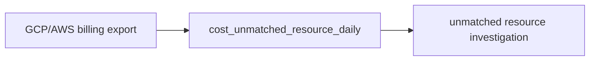
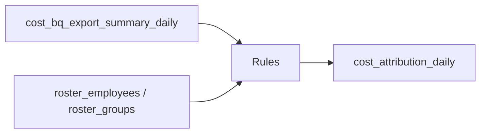
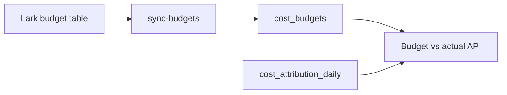

# Cost Data System Design

## Goals

Build a small, vendor-neutral cost data system that can:

- collect cost and usage details from cloud billing sources
- preserve enough line-item detail for arbitrary aggregation
- attribute CI usage and cost by `author`, `repo`, roster group, and manager
- compare attributed spend with period budgets later
- support GCP first, then AWS and other vendors without table renames

Non-goals for the first version:

- real-time cost enforcement
- complex budget workflow or Lark sync
- full historical roster snapshots
- a generic FinOps warehouse with every cloud-specific field promoted to columns

## Project Layout

The cost system should live in a new top-level project folder:

```text
cost-insight/
  docs/
  sql/
  src/cost_insight/
  tests/
```

This keeps cost independent from `ci-dashboard`. The two systems can share the
same TiDB instance and can join roster tables, but cost owns its own schema,
jobs, and API surface.

## Source Direction

Use BigQuery billing exports as the primary cost source.

For GCP, the preferred source is Cloud Billing Detailed usage export:

```text
gcp-digital-bi.gcp_billing_detailed.gcp_billing_export_resource_v1_01D088_8F9CF2_8AF1C6
```

This source has resource-level fields, usage fields, labels, credits, list-cost
fields, price fields, and export timestamps. It is a better primary source than
Billing APIs because the system needs arbitrary aggregation and invoice-like
line items.

Current known facts for the first GCP source:

| Field | Value |
| --- | --- |
| GCP project to import | `pingcap-testing-account` |
| Earliest useful history | `2026-01-01` |
| Approximate source volume | about 330K billing export rows per day |
| Currency | `USD` |
| Last validated local access | available through `bq` from this workspace |

The ETL should aggregate this source before writing to TiDB. We do not need to
store every hourly export row locally.

Use APIs only as auxiliary sources:

- Billing Account API: account and project metadata
- Budget API or Lark: budget metadata later

Native GKE Cost Allocation is enabled for the current GCP project. Cloud
Billing Detailed Export is therefore both the invoice source and the
Kubernetes allocation source: it carries cluster, namespace, workload,
author/repo labels, direct workload list cost, and explicit residual classes.
The cost pipeline does not query GKE usage-metering tables.

Known useful labels in current GCP billing and usage exports:

| Source label | Normalized column | Usage |
| --- | --- | --- |
| `k8s-label/author` or `author` | `author` | CI person attribution |
| `k8s-label/org` or `org` | `org` | GitHub organization grouping |
| `k8s-label/repo` or `repo` | `repo` | repo-level budget and cost views |
| `k8s-namespace` or row namespace | `namespace` | CI vs system/platform grouping |
| Pod/resource name from source export | `resource_name` | Resource investigation when labels are missing |

Validation snapshot from the last 30 days:

| Check | Result |
| --- | --- |
| billing export rows for `pingcap-testing-account` | about 29.8M rows |
| rows with `author/repo/org` | about 18.2% |
| net cost with `author/repo/org` | about 26.6% |
| rows with namespace | about 92.0% |
| rows with resource or workload name | about 99.8% |
| net cost with resource or workload name | about 98.4% |

This means label enrichment is important, but the raw billing export already
has enough resource/workload naming to investigate most unallocated cost.

## Cost Terms

The system should expose four related amounts:

| Term | Meaning |
| --- | --- |
| `list_cost` | Cost at public/list price before negotiated discount |
| `effective_cost` | Cost after negotiated or contract discount, before credits |
| `credit_amount` | Credits, promotions, CUD/SUD credits, or adjustments; usually negative |
| `net_cost` | Actual charged/allocated cost after credits: `effective_cost + credit_amount` |

For GCP billing export:

| System field | GCP source field |
| --- | --- |
| `list_cost` | `cost_at_list` or `cost_at_list_consumption_model` |
| `effective_cost` | `cost` or `cost_at_effective_price_default` |
| `credit_amount` | `SUM(credits.amount)` |
| `net_cost` | `cost + SUM(credits.amount)` |

When a source does not provide all fields, leave the missing amount as `NULL`
instead of inventing values.

## Tables

### `cost_sources`

Stores the smallest cloud billing or usage sources that cost collectors are
allowed to import. For GCP this is a project; for AWS this is an account.

```sql
CREATE TABLE cost_sources (
  id BIGINT NOT NULL AUTO_INCREMENT,
  vendor VARCHAR(32) NOT NULL,
  account_id VARCHAR(128) NOT NULL,
  billing_account_id VARCHAR(128) NULL,
  display_name VARCHAR(255) NULL,
  is_active TINYINT(1) NOT NULL DEFAULT 1,
  created_at DATETIME NOT NULL DEFAULT CURRENT_TIMESTAMP,
  updated_at DATETIME NOT NULL DEFAULT CURRENT_TIMESTAMP ON UPDATE CURRENT_TIMESTAMP,
  PRIMARY KEY (id),
  UNIQUE KEY uk_cost_sources_vendor_account (vendor, account_id),
  KEY idx_cost_sources_billing_account (billing_account_id)
);
```

Sample:

| vendor | account_id | billing_account_id | display_name |
| --- | --- | --- | --- |
| `gcp` | `pingcap-testing-account` | `01ABCD-234EFG-567HIJ` | `PingCAP Testing` |
| `aws` | `123456789012` | `123456789012` | `QE CI AWS` |

Notes:

- `account_id` means GCP project ID for GCP and AWS account ID for AWS.
- `billing_account_id` is nullable because some usage-only sources might not
  know the billing account.
- No `environment` column for now. The source itself is already the minimum
  collection unit, and sub-classification should come from labels, repo, group,
  or manager.
- No generic `metadata_json` for now. If a concrete source attribute becomes
  necessary, add a named column or a separate mapping table then.

### `cost_bq_export_summary_daily`

Durable daily billing-import ledger for GCP and AWS. A row is scoped by export
partition, usage date, source account, and the normalized billing dimensions in
the source row hash. Late corrections can be imported without scanning or
rebuilding a deprecated TiDB raw-detail layer.

Regular collectors write this table, and attribution refreshes read it. The
source BigQuery billing exports remain authoritative for invoice-level or
one-off raw investigation. See
[BigQuery cost optimization design](bigquery-cost-optimization-design.md) for
the import and correction model.

### `cost_unmatched_resource_daily`

Weekly resource-level investigation data. It is separate from the regular
summary ledger because resource names, labels, and usage duration have much
higher cardinality and are not needed by normal dashboard summaries.

The Dashboard combines these rows with current attribution to show unmatched
resources. Historical invoice reconciliation remains in BigQuery.

### `cost_attribution_daily`

Daily attributed summary by author, repo, roster group, and manager.

```sql
CREATE TABLE cost_attribution_daily (
  id BIGINT NOT NULL AUTO_INCREMENT,
  usage_date DATE NOT NULL,
  vendor VARCHAR(32) NOT NULL,
  account_id VARCHAR(128) NOT NULL,
  service_name VARCHAR(255) NULL,
  sku_name VARCHAR(255) NULL,

  org VARCHAR(255) NULL,
  repo VARCHAR(255) NULL,
  resource_name VARCHAR(512) NULL,
  author VARCHAR(255) NULL,
  owner VARCHAR(255) NULL,
  attribution_key VARCHAR(255) NULL,
  attribution_source VARCHAR(64) NOT NULL,
  attribution_status VARCHAR(64) NOT NULL,

  employee_id BIGINT NULL,
  group_id BIGINT NULL,
  manager_id BIGINT NULL,

  usage_seconds DECIMAL(20, 2) NULL,
  list_cost DECIMAL(16, 2) NULL,
  effective_cost DECIMAL(16, 2) NULL,
  credit_amount DECIMAL(16, 2) NULL,
  net_cost DECIMAL(16, 2) NULL,
  source_rows BIGINT NOT NULL DEFAULT 0,
  dimension_hash CHAR(64) NOT NULL,
  updated_at DATETIME NOT NULL DEFAULT CURRENT_TIMESTAMP ON UPDATE CURRENT_TIMESTAMP,

  PRIMARY KEY (id),
  UNIQUE KEY uk_cost_attribution_daily_dimension_hash (usage_date, dimension_hash),
  KEY idx_cost_attribution_daily_author (usage_date, author),
  KEY idx_cost_attribution_daily_repo (usage_date, org, repo),
  KEY idx_cost_attribution_daily_group (usage_date, group_id),
  KEY idx_cost_attribution_daily_manager (usage_date, manager_id)
);
```

Sample:

| usage_date | account_id | service_name | sku_name | repo | author | resource_name | attribution_status | group_id | manager_id | usage_seconds | net_cost |
| --- | --- | --- | --- | --- | --- | --- | --- | --- | --- | --- | --- |
| `2026-05-18` | `pingcap-testing-account` | `Compute Engine` | `N1 Predefined Instance Core running in Americas` | `ticdc` | `liyishuai` | `cap-ticdc-pull-cdc-storage-integration-light-next-gen-318-qh26q` | `matched` | `42` | `7` | `65700.00` | `245.12` |
| `2026-05-18` | `pingcap-testing-account` | `Cloud Storage` | `Standard Storage US` | `NULL` | `NULL` | `NULL` | `unmatched` | `NULL` | `NULL` | `NULL` | `31.50` |

Attribution rules for V1:

1. CI usage uses `author` as the primary key.
2. `owner` is supported but lower priority because current CI labels mainly use
   `author`.
3. Match `author` to `roster_employees.github_id` first.
4. If the value looks like an email, match `roster_employees.email`.
5. Attach `group_id` and `manager_id` from the current active roster.
6. System namespaces such as `kube-system` and `flux-system` are marked
   `system` unless labels clearly identify an owner.
7. Unmatched rows stay visible with `attribution_status = 'unmatched'`.

### `cost_budgets`

Budget table for later Lark sync. Budgets are requested for a period, usually a
year, with explicit start and end dates. Monthly budget views and alerts should
derive a monthly allocation from this period budget instead of storing budgets
as if they were requested month by month.

```sql
CREATE TABLE cost_budgets (
  id BIGINT NOT NULL AUTO_INCREMENT,
  vendor VARCHAR(32) NOT NULL,
  account_id VARCHAR(128) NOT NULL,
  period_start_date DATE NOT NULL,
  period_end_date DATE NOT NULL,
  budget_name VARCHAR(255) NULL,
  label_filters JSON NULL,
  filter_hash CHAR(64) NOT NULL,
  group_id BIGINT NULL,
  manager_id BIGINT NULL,
  repo VARCHAR(255) NULL,
  budget_amount DECIMAL(16, 2) NOT NULL,
  source_type VARCHAR(64) NOT NULL DEFAULT 'manual',
  source_ref VARCHAR(512) NULL,
  created_at DATETIME NOT NULL DEFAULT CURRENT_TIMESTAMP,
  updated_at DATETIME NOT NULL DEFAULT CURRENT_TIMESTAMP ON UPDATE CURRENT_TIMESTAMP,
  PRIMARY KEY (id),
  UNIQUE KEY uk_cost_budgets_scope (
    vendor,
    account_id,
    period_start_date,
    period_end_date,
    filter_hash
  ),
  KEY idx_cost_budgets_period (period_start_date, period_end_date),
  KEY idx_cost_budgets_group (group_id),
  KEY idx_cost_budgets_manager (manager_id),
  KEY idx_cost_budgets_repo (repo)
);
```

Sample:

| period_start_date | period_end_date | vendor | account_id | budget_name | label_filters | repo | budget_amount |
| --- | --- | --- | --- | --- | --- | --- | --- |
| `2026-01-01` | `2026-12-31` | `gcp` | `pingcap-testing-account` | `TiCDC CI` | `{"repo":"ticdc","org":"pingcap"}` | `ticdc` | `60000.00` |
| `2026-01-01` | `2026-12-31` | `gcp` | `pingcap-testing-account` | `Other CI` | `{"repo":["tidb","pd","tikv"]}` | `NULL` | `144000.00` |

Notes:

- `label_filters = NULL` means the whole source account/project.
- JSON filter semantics are AND across keys. A scalar value means equality; an
  array means `IN`.
- `filter_hash` is SHA256 over canonicalized `label_filters`, with keys sorted
  and array values sorted. The helper lives in `cost_insight.budgets` so budget
  sync can reuse one deterministic implementation.
- `group_id`, `manager_id`, and `repo` are optional denormalized fields for fast
  filtering in common views. The authoritative matching condition is
  `label_filters`.

### `cost_job_state`

Tracks ETL watermarks and run status.

```sql
CREATE TABLE cost_job_state (
  job_name VARCHAR(128) NOT NULL,
  watermark_json JSON NOT NULL,
  last_started_at DATETIME NULL,
  last_succeeded_at DATETIME NULL,
  last_status VARCHAR(16) NOT NULL DEFAULT 'never',
  last_error TEXT NULL,
  updated_at DATETIME NOT NULL DEFAULT CURRENT_TIMESTAMP ON UPDATE CURRENT_TIMESTAMP,
  PRIMARY KEY (job_name)
);
```

Sample watermarks:

| job_name | watermark_json |
| --- | --- |
| `sync_gcp_billing_summary:gcp:pingcap-testing-account` | `{"account_id":"pingcap-testing-account","export_partition_start":"2026-05-15","export_partition_end":"2026-05-18"}` |
| `refresh_cost_attribution_from_summary:aws:946646677266` | `{"vendor":"aws","account_id":"946646677266","start_date":"2026-05-01","end_date":"2026-05-31"}` |

## ETL Flow

### Flow 1: Billing Summary Import


```mermaid
flowchart LR
  Export["GCP/AWS billing export"] --> Summary["cost_bq_export_summary_daily"]
  Summary --> Attribution["summary attribution refresh"]
```

Steps:

1. Discover active sources from `cost_sources`.
2. Read bounded export partitions so BigQuery can prune source data.
3. Normalize provider fields and upsert by the stable source-row hash.
4. Refresh attribution for usage dates touched by imported partitions.
5. Advance the source watermark only after writes and attribution succeed.

### Flow 2: Resource Investigation Import


```mermaid
flowchart LR
  Export["GCP/AWS billing export"] --> Resource["cost_unmatched_resource_daily"]
  Resource --> Dashboard["unmatched resource investigation"]
```

Resource-level rows are imported separately on a bounded weekly window. This
keeps resource names, raw labels, and usage duration out of the normal billing
summary path.

### Flow 3: Attribution Refresh

Purpose: map cost and usage to author, repo, group, and manager.


```mermaid
flowchart LR
  Summary["cost_bq_export_summary_daily"] --> Rules
  Roster["roster_employees / roster_groups"] --> Rules
  Rules --> Daily["cost_attribution_daily"]
```

Rules:

1. Build a working set for affected dates.
2. Read normalized billing and allocation columns from the summary ledger.
3. Use `author` first for CI attribution.
4. Join `author` to `roster_employees.github_id`.
5. If GitHub ID does not match, try employee email and email local-part.
6. Attach `group_id` and `manager_id` from current roster tables. If an
   employee manager is missing, fall back to the roster group's manager.
7. Aggregate by day, vendor, account, service, SKU, org, repo, resource, author,
   group, and manager.
8. Write unmatched data instead of hiding it.
9. Refresh is rebuildable by date range: delete existing attributed rows for
   the same `vendor/account/date` range, then insert the newly aggregated
   result. This keeps late billing corrections and roster fixes simple.
10. Run larger refreshes with `--split-by-day` so each TiDB query stays within
    the single-query memory quota.

Current V1 attribution statuses:

| status | source | Meaning |
| --- | --- | --- |
| `matched` | `author_github` | `author` matched active roster GitHub ID |
| `matched` | `author_email` | `author` matched active roster email or email local-part |
| `unmatched` | `author_label` | `author` exists but no active roster employee matched |
| `unattributed` | `missing_author` | no author label exists |

Cost allocation with billing export:

1. Preserve provider-native GKE direct workload costs.
2. Allocate GKE idle and system-overhead residuals using positive native direct
   list-cost share inside the same day/project/cluster/SKU/component.
3. Preserve unsupported, unknown, control-plane, and no-participant residuals.
4. Refresh native owner/group attribution from the current roster.
5. Materialize three daily perspectives: Kubernetes allocated, EQ allocated,
   and Kubernetes then EQ allocated.
6. EQ chargeback uses same-day/vendor/account non-EQ native direct list-cost
   share. A zero denominator leaves the cost under EQ.
7. TCMS `shared_pool` remains visible metadata; it is not weighted or
   redistributed.

The Dashboard selects native or one published materialized perspective and
only aggregates it by week or month. Full rules and conservation contracts are
in [Unified cost allocation design](cost-allocation-unification-design.md).

### Flow 4: Budget Sync Later

Purpose: load period budgets from Lark or another source.


```mermaid
flowchart LR
  Lark["Lark budget table"] --> Sync["sync-budgets"]
  Sync --> Budgets["cost_budgets"]
  Budgets --> Compare["Budget vs actual API"]
  Attr["cost_attribution_daily"] --> Compare
```

Expected budget shapes:

- GCP `pingcap-testing-account`, `ticdc` annual CI budget
- GCP `pingcap-testing-account`, other CI annual budget
- group or manager period budget
- repo-level period budget when a repo maps cleanly to a group

Initial matching rule:

- Use `label_filters` as the authoritative budget matcher.
- For repo budgets such as TiCDC, match by repo first, for example
  `{"repo":"ticdc"}` or `{"repo":"ticdc","org":"pingcap"}`.
- Do not require a roster group mapping for repo budgets in V1.

For monthly dashboards or alerts, calculate a derived monthly budget from the
period budget. For example, a yearly budget can be divided into 12 equal monthly
allocations unless the Lark source later provides a custom allocation curve.

Budget sync can wait until the cost and usage pipeline is stable.

## Current Implementation

1. Apply SQL migrations through the latest file under `sql/`.
2. Import GCP and AWS billing partitions with the summary commands.
3. Refresh `cost_attribution_daily` from the summary ledger.
4. Import weekly resource investigation data separately.
5. Publish Kubernetes residual allocation facts after billing data settles.
6. Materialize and publish the three derived cost perspectives.
7. Add budget sync when a source of truth replaces the current manual rows.

## Open Questions

- Does the production job service account have access to
  `gcp-digital-bi.gcp_billing_detailed`?
- Which service account will run the scheduled sync, and should we use the
  local `bq` user credential first or create a dedicated GCP service account?

Resolved decisions:

- Kubernetes residual allocation runs before EQ chargeback.
- All current-EQ-owned costs are chargeback eligible; anonymous costs are not
  inferred to be EQ-owned.
- Label enrichment is preferred over blindly allocating costs with incomplete
  labels.
- Repo budgets use `label_filters` and match repo first. TiCDC starts as
  `{"repo":"ticdc"}` or `{"repo":"ticdc","org":"pingcap"}`.

## References

- [Google Cloud Billing BigQuery export overview](https://docs.cloud.google.com/billing/docs/how-to/export-data-bigquery)
- [Google Cloud Billing export table types](https://docs.cloud.google.com/billing/docs/how-to/export-data-bigquery-tables)
- [Google Cloud Detailed usage cost export schema](https://docs.cloud.google.com/billing/docs/how-to/export-data-bigquery-tables/detailed-usage)
- [Google Cloud Billing APIs overview](https://docs.cloud.google.com/billing/docs/apis)
